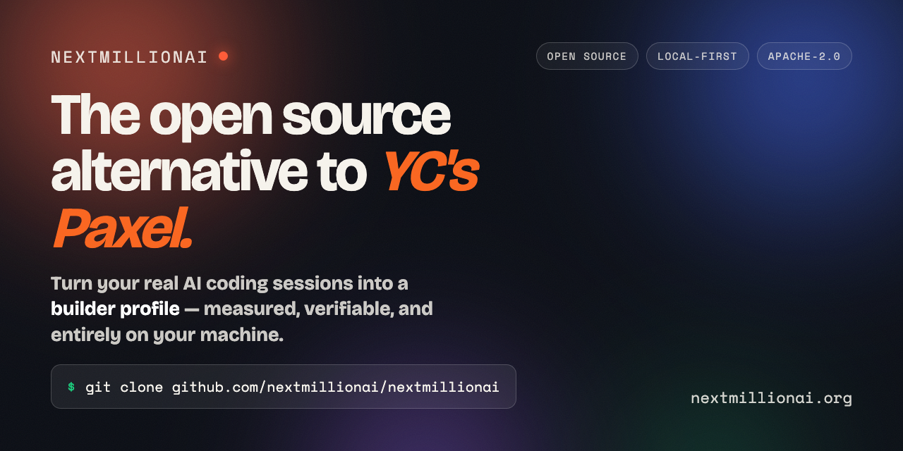
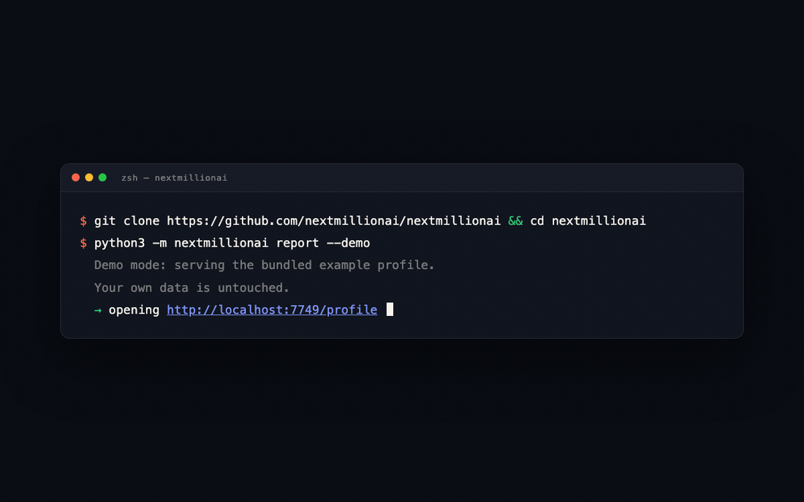

<div align="center">



# nextmillionai

**Your AI coding profile, computed entirely on your machine.**

The open alternative to Paxel — read **your own** AI coding sessions and git
history, measure *how* you build with AI, and render a shareable **profile** and a
deep **report** from one assessment JSON. No account, no upload, no black box.

**Your profile in under a minute** — one command, no signup, no setup.

[](https://github.com/nextmillionai/nextmillionai/actions/workflows/ci.yml)
[](LICENSE)


[Story](https://nextmillionai.org/story) ·
[Why](https://nextmillionai.org/why) ·
[FAQ](https://nextmillionai.org/faq) ·
[Docs](https://nextmillionai.org/docs) ·
[Methodology](https://nextmillionai.org/methodology) ·
[Contributing](CONTRIBUTING.md)



<sub>One command → your <b>profile</b> and a deep <b>report</b>, rendered locally from bundled demo data (<code>report --demo</code>).</sub>

</div>

> [!IMPORTANT]
> **Two promises** (full text: [PRIVACY.md](PRIVACY.md)):
> 1. Your code, prompts, and scores **never reach nextmillionai** — no server in the assessment path, no silent upload.
> 2. The assessment is **computed entirely from local files**: arithmetic over counted signals against research-anchored bands. No percentiles, no leaderboards. Unmeasurable is marked *insufficient*, never estimated.
>
> How we keep it honest and hard to game: [docs/TRUST.md](docs/TRUST.md).

<details>
<summary><b>Table of contents</b></summary>

- [See it in 10 seconds](#see-it-in-10-seconds)
- [Your own profile in one command](#your-own-profile-in-one-command)
- [nextmillionai vs Paxel](#nextmillionai-vs-paxel)
- [What it measures](#what-it-measures)
- [Connecting your work](#connecting-your-work)
- [Running the server](#running-the-server)
- [Sharing — three levels, each explicit](#sharing--three-levels-each-explicit)
- [The methodology is open — and living](#the-methodology-is-open--and-living)
- [From inside your agent (MCP / plugin)](#from-inside-your-agent-mcp--plugin)
- [Repo design](#repo-design-60-seconds)
- [Docs](#docs)
- [Development](#development)

</details>

## See it in 10 seconds

```bash
git clone https://github.com/nextmillionai/nextmillionai && cd nextmillionai
python3 -m nextmillionai report --demo
```

Serves a bundled example profile (a rich, engine-generated
`nextmillionai/examples/profile.json`) and opens your browser — your own data is
untouched. Requirements: **Python 3.9+, zero runtime dependencies.** Runs straight
from the clone — no install step, no build.

> [!NOTE]
> A one-line `pipx install nextmillionai` / `uvx nextmillionai` is coming in a
> later release. For now, git clone is the whole install.

## Your own profile in one command

```bash
python3 -m nextmillionai start       # consent (first run) → assess → opens both views
```

Or run the steps yourself:

| Command | What it does |
|---|---|
| `calibrate` | Consent + scope — you see exactly what's read, and save your answers |
| `assess` | Scan + score locally → one assessment JSON |
| `report` | Serve both views; picks a free port, opens the browser |
| `enrich` | Your own agent writes the narrative — never a score |
| `export` | Write a static, self-hostable folder (redacted) |
| `publish` / `unpublish` | Send the curated JSON to a registry (opt-in) / revoke |
| `sync` | Merge devices through a private repo you own |

**Then run `enrich`** — the scan is the numbers; enrich is the story:

```bash
python3 -m nextmillionai enrich                 # prints a prompt; paste it into YOUR agent
python3 -m nextmillionai enrich --submit result.json
```

Your own agent (Claude Code, Cursor — or your own API key) writes the narrative:
what you built, your decision patterns, strengths. It runs locally, it's opt-in and
revocable (`enrich --revoke`), and it **can never change a score** — models write
words here, never numbers. A profile without enrich is a dashboard; with it, it
reads like a reference letter backed by measurements.

## nextmillionai vs Paxel

Same goal — a credible profile of how you build with AI. Opposite architecture.

| | **nextmillionai** | Paxel |
|---|---|---|
| Where it runs | Your machine | Their servers |
| Your code & prompts | Never leave your disk | Uploaded |
| Scoring methodology | Open + versioned + citable | Closed |
| What you get | The assessment JSON + both views, yours to host | A hosted profile |
| Ranking / percentiles | None — a map, never a ladder | — |
| License & price | Apache-2.0, free | — |

Why we built it this way: **[nextmillionai.org/why](https://nextmillionai.org/why)**
· the longer story: **[nextmillionai.org/story](https://nextmillionai.org/story)**.

## What it measures

Six dimensions, each scored as plain arithmetic over counted local signals against
research-anchored bands — never a curve fit to one machine. Full formulas and
sources: **[nextmillionai.org/methodology](https://nextmillionai.org/methodology)**
· [SCORING-METHODOLOGY.md](nextmillionai/docs/SCORING-METHODOLOGY.md).

| Dimension | What it captures |
|---|---|
| **Signal Clarity** | How precisely you direct the AI — prompt specificity, iterations to a usable result |
| **Build Stability** | Whether AI-assisted code survives — churn, revert rate, post-edit stability |
| **Decision Weight** | The weight and durability of your technical decisions |
| **Recovery Velocity** | How fast and systematically you recover when the AI is wrong |
| **Context Command** | How well you carry context across tools and sessions |
| **Orchestration Range** | How many tools, models, and agents you coordinate effectively |

Dimensions combine into **nine archetypes** and **twelve crafts** (plus the AI
Explorer baseline everyone holds), placed on a build-domain × leverage
**positioning map** — a map, never a ladder. Anything that can't be measured is
marked *insufficient* and excluded; your profile shows a completeness indicator
rather than a fabricated number.

## Connecting your work

**Tools** are auto-discovered from their own local stores — say yes per source in
`calibrate` (re-running it keeps your saved answers):

| Tier | Tools |
|---|---|
| First-class | Claude Code, Cursor (full composer history, all storage generations), Codex CLI, Kiro (CLI + IDE, deep fidelity), git |
| Wider field | VS Code (Copilot Chat / Cline / Cody), Continue.dev, Aider, OpenCode, Windsurf, Zed AI, Antigravity, JetBrains AI |
| Local models | Ollama, LM Studio, llama.cpp (GGUF caches) |

Every adapter declares its **fidelity** (deep / counts / presence) in Provenance —
what couldn't be read honestly is said, not faked. Full coverage contract:
[docs/ADAPTERS.md](docs/ADAPTERS.md). Missing your tool? Register it with a config
block (`nextmillionai.config.json`) or upstream an adapter — see
[CONTRIBUTING.md](CONTRIBUTING.md).

**Repos** are discovered from your sessions' working directories and scanned via git
(commit log + dependency names only — never code). Narrow the window or repo set in
`calibrate`; scan one ad-hoc repo with `assess --project ~/path`; add deeper repo
evidence (metrics only, opt-in) with `assess --code`. Every `assess` ends with a
**coverage report**: what exists on your machine that wasn't collected, and the one
knob that widens it.

**More machines?** `sync` merges devices through a private repo YOU own — deduped,
never double-counted, revocable ([docs/SYNC.md](docs/SYNC.md)).

## Running the server

`report` picks the first free port from 7749, opens your browser (`--no-open` to
skip), and serves:

| Route | What it is |
|---|---|
| `/profile` | The credential dashboard — Overview · Work · Lab · Provenance · Share |
| `/report` | The deep, shareable deliverable — narrative, scores, positioning map, per-project breakdown, evidence appendix |
| `/methodology` | Every formula, served from the same engine as an interactive explorer |
| `/how-it-works` | Command reference + pipeline map, with search (same content as the [hosted docs](https://nextmillionai.org/docs), served locally) |

## Sharing — three levels, each explicit

1. **Local** (default): localhost only.
2. **Self-host**: `export` writes a static folder with a redacted `assessment.json`
   — hidden projects, growth areas, and private signals are verified absent. The
   **report is the shareable artifact**; what makes it trustworthy (and what
   doesn't) is [docs/TRUST.md](docs/TRUST.md).
3. **Publish** (reverse hiring — *coming soon* as a hosted network): `publish` sends
   the same curated JSON to a registry, after showing exactly what leaves and
   requiring explicit confirmation; `unpublish` revokes. Today it targets a
   self-hosted reference registry.

## The methodology is open — and living

Measuring *how* someone builds with AI is a brand-new field, and it moves fast. So
the scoring here isn't a fixed black box — it's a **living methodology**: every
number is plain arithmetic over counted signals (`scoring.py`), the bands are
research-anchored, and the whole contract is published and **versioned** in
[SCORING-METHODOLOGY.md](nextmillionai/docs/SCORING-METHODOLOGY.md). No model ever
writes a score; anything we can't measure is *insufficient*, never estimated.

It's calibrated for **developers and AI engineers** — people who build software with
AI — and not yet for other kinds of AI builders
([who this is for](nextmillionai/docs/SCORING-METHODOLOGY.md#who-this-is-calibrated-for)).

**It's yours to shape.** As the community learns what "good" looks like, the
methodology should learn with it:

- **Debate it** in [Discussions → Methodology](https://github.com/nextmillionai/nextmillionai/discussions/categories/methodology).
- **Propose a change** with a PR against `SCORING-METHODOLOGY.md` — bring evidence or
  a good example. Accepted changes ship as a transparent methodology-version bump.
- Start from the [open questions](nextmillionai/docs/SCORING-METHODOLOGY.md#open-questions) — the calibrations we're least sure of.

See [CONTRIBUTING.md](CONTRIBUTING.md) for the flow.

## From inside your agent (MCP / plugin)

*Coming soon.* An MCP server with **15 tools** lets any MCP-compatible agent (Claude
Code, Cursor, Cline) build and query your profile directly. The code is in the repo
(`nextmillionai-mcp/`); setup instructions will land here when it's ready.

| Group | Tools |
|---|---|
| Assess & view | `nma_calibrate`, `nma_assess`, `nma_get_profile`, `nma_get_report`, `nma_serve` |
| Narrative | `nma_enrichment_request`, `nma_enrichment_submit` |
| Share | `nma_export`, `nma_publish`, `nma_unpublish`, `nma_profile_url` |
| Discover & coach | `nma_discover_builders`, `nma_compare_to_role`, `nma_growth_edge`, `nma_doctor` |

## Repo design (60 seconds)

```
nextmillionai/            the Python engine (zero deps)
  adapters/               one adapter per tool; fidelity declared
  scanner.py → build_profile.py → scoring.py    scan → assess → score
  history.py              durable local ledger (evidence survives pruning)
  signal_registry.py      every derived field declares inputs + rule
  hub.py                  localhost server (the ONLY inbound surface)
  network.py              the ONLY outbound module (publish/sync, opt-in)
  static/                 profile.html / report.html + css/js (one JSON in)
  docs/                   SCORING-METHODOLOGY.md, SCHEMA.md (contracts)
nextmillionai-mcp/        MCP server (Node) — coming soon
docs/                     ADAPTERS, SYNC, TRUST, DESIGN
tests/                    640+ tests incl. privacy guards + engine invariants
```

Map of everything: [ARCHITECTURE-CRUISE-AI.md](docs/ARCHITECTURE-CRUISE-AI.md) · [ARCHITECTURE.md](ARCHITECTURE.md) · [CURRENT.md](CURRENT.md) · [How It Works (full pipeline)](docs/HOW-IT-WORKS.md).

## Docs

Hosted at **[nextmillionai.org/docs](https://nextmillionai.org/docs)**, and served
locally on `/how-it-works` whenever you run `report`.

| Doc | What it covers |
|---|---|
| [SCORING-METHODOLOGY](nextmillionai/docs/SCORING-METHODOLOGY.md) | Every formula and band, with provenance |
| [SCHEMA](nextmillionai/docs/SCHEMA.md) | The one assessment JSON + shareable/private map |
| [ADAPTERS](docs/ADAPTERS.md) | Tool coverage, fidelity, exactly what's read |
| [TRUST](docs/TRUST.md) | Anti-gaming: what a report proves, what it doesn't |
| [DESIGN](docs/DESIGN.md) | The in-app design language |
| [PRIVACY](PRIVACY.md) · [DATA_COLLECTION](DATA_COLLECTION.md) | The two promises, per-source reads |
| [THESIS](THESIS.md) | Why proof-of-work hiring, and the research behind it |

## Development

```bash
pip install -e ".[dev]"
ruff check . && ruff format --check . && mypy nextmillionai && pytest
```

CI runs all four gates on Python 3.9–3.12, including the privacy guards (no outbound
network in the assessment path) and the engine invariants (one fact, one value,
everywhere).

---

<div align="center">

Built by a coordinated fleet of AI coding agents — we practice what we measure.

Apache License 2.0 — [LICENSE](LICENSE) · [NOTICE](NOTICE) ·
[Contributing](CONTRIBUTING.md) · [Security](SECURITY.md)

</div>
