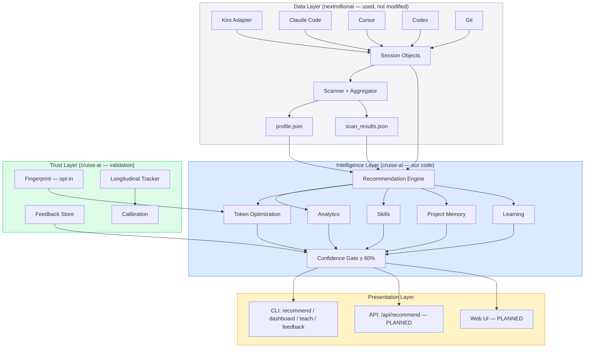
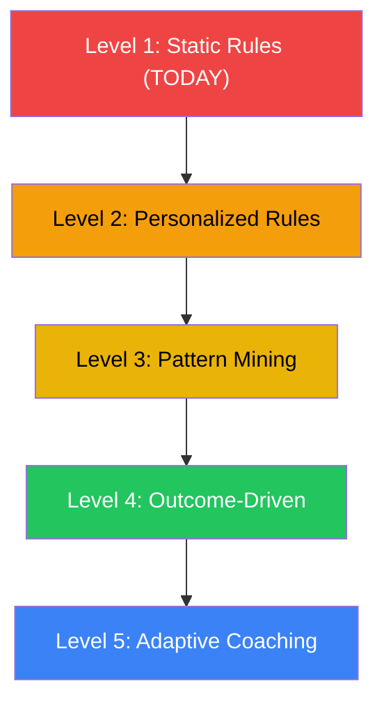
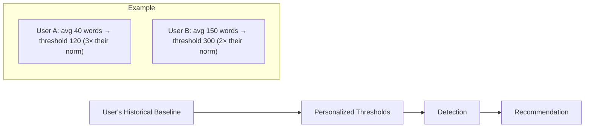
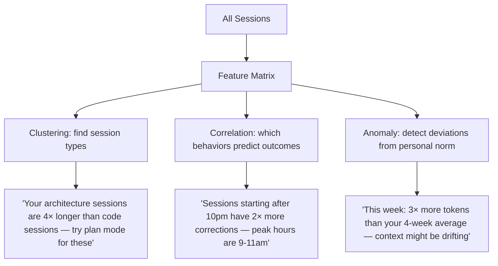
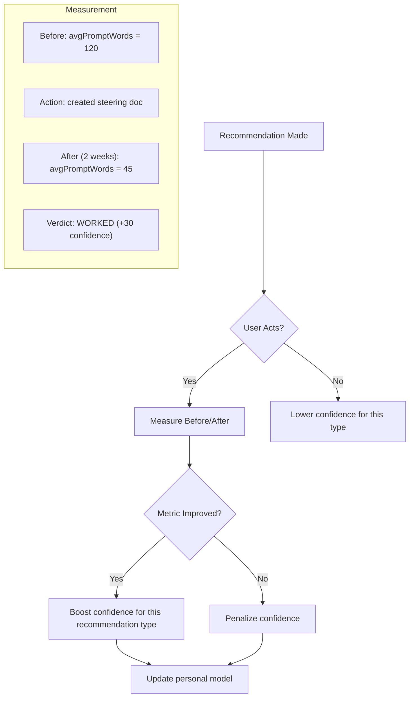
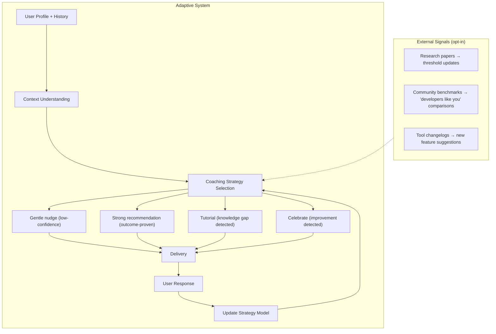

# cruise-ai Architecture & Recommendations Strategy

---

## Part 1: Architecture

### System Overview

cruise-ai is a coaching layer built on top of nextmillionai's data collection and scoring infrastructure.



### Dependency Map

| Component | Source | Modified by cruise-ai? |
|-----------|--------|----------------------|
| Adapters (data collection) | nextmillionai | ❌ No |
| Scanner / Aggregator | nextmillionai | ❌ No |
| Scoring / Dimensions | nextmillionai | ❌ No (fingerprint-pinned) |
| Profile JSON schema | nextmillionai | ❌ No |
| Consent system | nextmillionai | ❌ No |
| HTTP server (hub.py) | nextmillionai | ✅ Will extend (add endpoints) |
| Static UI (static/) | nextmillionai | ✅ Will extend (add pages) |
| **recommendations/** | cruise-ai original | ✅ Ours |
| **feedback.py** | cruise-ai original | ✅ Ours |
| **fingerprint.py** | cruise-ai original | ✅ Ours |
| **longitudinal.py** | cruise-ai original | ✅ Ours |
| **CLI commands** | cruise-ai original | ✅ Ours |

### What We Consume vs What We Produce

```
INPUT (from nextmillionai):
  ├── Session[] — per-session: tool_calls_by_type, prompt_word_counts, models, timestamps
  ├── profile.json — wrappedStats, dimensions, workMode, archetypes
  └── scan_results.json — raw data, normalized metrics, activity

OUTPUT (cruise-ai produces):
  ├── Recommendation[] — categorized, confidence-scored, with teach/auto modes
  ├── Dashboard data — usage, cost, models, projects, timeline
  ├── Feedback history — acted/dismissed/useful tracking
  ├── Longitudinal snapshots — metric trends over time
  └── Fingerprints — opt-in content deduplication
```

---

## Part 2: How Recommendations Work Today

### Current Approach: Rule-Based Threshold Detection

```
Session data → Count/aggregate → Compare to thresholds → Emit if confident
```

Every recommendation is a `if signal > threshold → suggest action` rule:

| Signal | Threshold | Recommendation |
|--------|-----------|---------------|
| >20% prompts > 300 words | `observed` (from nextmillionai's signal_clarity research) | Compress prompts |
| >50% sessions cluster at same first-prompt length | `heuristic` (proxy for duplication) | Create steering doc |
| >80% sessions use premium models | `heuristic` | Model routing |
| Tool in >60% sessions (non-basic) | `heuristic` | Create a Skill |
| Same project, ≥8 sessions, avg first-prompt >100 words | `heuristic` | Project memory |
| planModePercent < 5%, sessions > 20 | `observed` | Learn plan mode |

### Limitations of Current Approach

| Limitation | Impact | Root Cause |
|-----------|--------|------------|
| No content analysis | Can't detect WHAT is duplicated, only THAT lengths cluster | Privacy constraint (never reads text) |
| Static thresholds | Same threshold for everyone regardless of role/domain | No personalization |
| No outcome measurement | Don't know if acting on a recommendation actually helped | No before/after tracking (longitudinal is new, no data yet) |
| No temporal patterns | Can't detect "you used to be efficient, now you're not" | Only analyzes current snapshot |
| No cross-user calibration | Thresholds from one project's observations, not population | Single-source research |
| No task context | A 500-word prompt for architecture design is fine; for a typo fix it's wasteful | No task classification |

---

## Part 3: The Plan — Industrial-Grade Recommendations

### What "Industrial Standard" Means

Products with validated recommendation systems share these properties:

| Property | Example | cruise-ai Status |
|----------|---------|-----------------|
| Research-backed thresholds | Spotify's skip-rate thresholds for song recommendations | ❌ Not yet |
| A/B tested interventions | Netflix testing which thumbnail increases clicks | ❌ Not feasible (single user) |
| Feedback loops | YouTube adjusting recommendations based on watch time | 🟡 Implemented, no data yet |
| Personalization | Amazon's "based on your history" | ❌ Not yet |
| Multi-signal fusion | Google ranking with 200+ signals | 🟡 We have ~12 detectors |
| Confidence calibration | Weather forecasts: "70% confident" means it rains 70% of the time | ❌ Not calibrated |
| Explainability | Credit score factor breakdown | ✅ teach_text on every rec |

### The 5-Level Upgrade Plan



---

### Level 1: Static Rules (Current State) ✅

```
Approach: Hardcoded thresholds
Trust: heuristic / observed
Personalization: None
Validation: Manual / feedback-based
```

What we have. Works, but not adaptive.

---

### Level 2: Personalized Rules

**Goal:** Same rules, but thresholds adapt to the user's baseline.



**Implementation:**

```python
# Instead of:
LONG_PROMPT_THRESHOLD = 300  # same for everyone

# Use:
def personal_threshold(user_avg: int) -> int:
    """Long = 3× your own average, minimum 150."""
    return max(150, user_avg * 3)
```

**What this needs:**
- Longitudinal data (3+ snapshots over time) — we have the infrastructure, need data
- Baseline computation per user

**Research backing:**
- Anomaly detection in time series (3-sigma rule adapted for skewed distributions)
- "Personal best" methodology from fitness tracking (Fitbit, Whoop)

**Effort:** Low — modify threshold logic to be relative, not absolute.

---

### Level 3: Pattern Mining

**Goal:** Detect patterns we didn't hardcode — find correlations in the user's data.



**Implementation options:**

| Technique | Library | What It Finds | Privacy |
|-----------|---------|---------------|---------|
| K-means on session features | scikit-learn | Session types (exploration, implementation, debugging) | ✅ Local |
| Pearson correlation | numpy/scipy | Which signals predict high correction rate | ✅ Local |
| Moving average anomaly | pandas | Deviations from personal norm | ✅ Local |
| Association rules | mlxtend | "When X happens, Y usually follows" | ✅ Local |
| Time-series decomposition | statsmodels | Trend + seasonality in usage | ✅ Local |

**What this needs:**
- ≥50 sessions with timestamps (most active users have this)
- Optional dependency on numpy/scipy (can be feature-flagged)
- Session feature extraction (already have: word counts, tools, timestamps, models, project)

**Research backing:**
- Apriori algorithm for association rule mining (Agrawal & Srikant, 1994)
- DBSCAN for session clustering without pre-specifying k
- CUSUM / EWMA for change-point detection in developer behavior

**Effort:** Medium — add optional scipy dep, feature matrix builder, 3-4 miners.

---

### Level 4: Outcome-Driven

**Goal:** Only recommend things that **actually improved** metrics for this user (or similar users).



**Implementation:**

```python
# In longitudinal.py (already exists):
def measure_outcome(action_type: str) -> Outcome:
    snapshots = load_snapshots()
    before = find_snapshot_before_action(action_type)
    after = latest_snapshot()
    return Outcome(
        action_type=action_type,
        metric="avgPromptWords",
        before=before.metrics["avgPromptWords"],
        after=after.metrics["avgPromptWords"],
        improved=after < before,  # lower is better for this metric
        confidence_delta=+30 if improved else -10,
    )
```

**What this needs:**
- ≥2 assessments with a feedback event between them (longitudinal.py exists, needs time)
- Metric-to-action mapping (which metric should improve after which action)
- 2-4 weeks of data per outcome measurement

**Research backing:**
- Interrupted time-series design (ITS) — standard in epidemiology and UX research
- Causal impact analysis (Google's CausalImpact R/Python package)
- N-of-1 trial methodology from personalized medicine

**Effort:** Medium — infrastructure exists (longitudinal.py), needs the linking logic + time.

---

### Level 5: Adaptive Coaching (Long-term Vision)

**Goal:** A coaching system that learns what works for THIS user and adapts.



**Components:**

| Component | What It Does | How |
|-----------|-------------|-----|
| **Coaching Strategy Selector** | Picks HOW to deliver a recommendation | Based on past response patterns (this user ignores "low" priority → only show "high") |
| **Temporal Awareness** | Knows WHEN to suggest | "You're starting a new project" → suggest project memory NOW |
| **Achievement System** | Positive reinforcement | "Your prompt length dropped 40% — steering docs working!" |
| **External Signal Integration** | Community + research updates | Opt-in: "Developers with similar patterns who created Skills saw 30% fewer corrections" |
| **Role-Aware Coaching** | Different advice for different roles | "As an architect, plan mode is high-value; as a prototyper, speed matters more" |

**What this needs:**
- Levels 2-4 working and producing data
- ≥3 months of longitudinal data per user
- Community opt-in for anonymized comparisons
- External signal feeds (tool changelogs, research paper digests)

**Research backing:**
- Intelligent Tutoring Systems (ITS) — decades of research in adaptive education
- Self-Determination Theory (Deci & Ryan) — autonomy, competence, relatedness
- Nudge theory (Thaler & Sunstein) — behavioral architecture
- Spaced repetition (Ebbinghaus) — timing of suggestions
- Zone of Proximal Development (Vygotsky) — suggest what's just beyond current ability

**Effort:** High — requires multiple iterations and data accumulation.

---

## Part 4: External Integrations That Would Strengthen Recommendations

### Thesis-Backed Scoring Integration

cruise-ai sits on top of nextmillionai's dimension scores. These scores can FEED recommendations:

```mermaid
flowchart LR
    subgraph Scores[Dimension Scores — from nextmillionai]
        SC[Signal Clarity: 72]
        OR[Orchestration Range: 45]
        CC[Context Command: 58]
        DW[Decision Weight: 33]
        RV[Recovery Velocity: 81]
        CO[Composure: 67]
    end
    
    subgraph Gap[Gap Analysis]
        G1["Orchestration = 45 → LOWEST → focus here"]
        G2["Decision Weight = 33 → LOW → plan mode opportunity"]
    end
    
    subgraph Rec[Score-Driven Recommendations]
        R1["Your Orchestration is your growth edge — try multi-model routing"]
        R2["Decision Weight is low — plan mode could raise it by 15-20 points"]
    end
    
    Scores --> Gap --> Rec
```



**Implementation:** Read the `dimensions` dict from profile.json, find the lowest dimension, map it to specific recommendations.

### External Data Sources (Opt-in)

| Source | What It Provides | Privacy Model |
|--------|-----------------|---------------|
| **Tool changelogs** (Kiro/Claude/Cursor release notes) | New features the user isn't using yet | Public data, no user data sent |
| **Community benchmarks** | "Developers with 50+ sessions typically have 3+ models" | Anonymized aggregates, opt-in |
| **Research papers** | Updated threshold evidence | Public data |
| **Project config files** (.kiro/steering, CLAUDE.md, .cursorrules) | Whether user already has steering docs | Local file existence check only |
| **Token pricing APIs** | Live model pricing for accurate cost estimates | Public API, no user data sent |

### Config-Aware Recommendations

```python
# Check if user already has project memory before recommending it
def _has_project_memory(project_path: str) -> bool:
    p = Path(project_path)
    return any([
        (p / ".kiro" / "steering").exists(),
        (p / "CLAUDE.md").exists(),
        (p / ".cursorrules").exists(),
        (p / "AGENTS.md").exists(),
    ])
```

This eliminates false positives: don't suggest "create a steering doc" if one already exists.

---

## Part 5: Implementation Roadmap

### Phase 1 (Now → 2 weeks): Foundation Hardening

| Task | Impact | Effort |
|------|--------|--------|
| Add dimension-score-driven recommendations | High — connects scoring to coaching | Low |
| Add project config detection (suppress false positives) | Medium — precision improvement | Low |
| Wire Web UI (API + HTML) | High — accessibility | Medium |
| Live pricing from public APIs | Low — accuracy improvement | Low |

### Phase 2 (2-6 weeks): Personalization

| Task | Impact | Effort |
|------|--------|--------|
| Personal baselines (thresholds relative to user's own history) | High — eliminates "one size fits all" | Medium |
| Temporal patterns (time-of-day, day-of-week correlations) | Medium — actionable insights | Medium |
| Session clustering (identify distinct work modes per user) | Medium — nuanced recommendations | Medium |
| Longitudinal outcome measurement (first real A/B-like data) | High — validates everything | Low (wait for data) |

### Phase 3 (6-12 weeks): Intelligence

| Task | Impact | Effort |
|------|--------|--------|
| Association rule mining ("when X, then Y") | High — discovers non-obvious patterns | Medium |
| Anomaly detection ("this week is unusual") | Medium — timely alerts | Medium |
| Outcome-driven confidence calibration | High — self-improving system | Medium |
| Community benchmarks (opt-in comparisons) | Medium — motivation | High |

### Phase 4 (3-6 months): Adaptive Coaching

| Task | Impact | Effort |
|------|--------|--------|
| Coaching strategy selection | High — right message at right time | High |
| Achievement/progress system | Medium — engagement | Medium |
| Role-aware recommendations | Medium — relevance | Medium |
| Research-backed threshold updates | High — credibility | Ongoing |

---

## Part 6: Research References for Validation

| Area | Key Paper / Standard | Relevance to cruise-ai |
|------|---------------------|----------------------|
| Prompt engineering effectiveness | "Large Language Models are Human-Level Prompt Engineers" (Zhou et al., 2023) | Validates that prompt structure matters for output quality |
| Developer productivity measurement | SPACE framework (Forsgren et al., 2021) | Framework for measuring developer productivity dimensions |
| Nudge theory | "Nudge: Improving Decisions" (Thaler & Sunstein, 2008) | How to suggest without being annoying |
| Intelligent tutoring | "Cognitive Tutors" (Anderson et al., 1995) | Adaptive instruction based on learner model |
| Anomaly detection | "Anomaly Detection: A Survey" (Chandola et al., 2009) | Baseline-relative detection methodology |
| Association rules | "Fast Algorithms for Mining Association Rules" (Agrawal & Srikant, 1994) | Pattern mining from session data |
| Self-determination theory | "Self-Determination Theory" (Ryan & Deci, 2000) | Intrinsic motivation framework for coaching |
| Time series in software eng. | "Statistical Tests for Change Point Detection" (Aminikhanghahi & Cook, 2017) | Detecting behavioral shifts |
| AI pair programming | "The Programmer's Brain" (Hermans, 2021) | Cognitive load theory applied to AI tool usage |
| Token optimization | "Efficient Prompting Methods in LLMs" (various, 2023-2024) | Context compression research |

---

## Summary

cruise-ai today is **Level 1** (static rules) with **Level 2-4 infrastructure already in place** (feedback, longitudinal, fingerprint). The path to industrial-grade is:

1. **Connect scores to recommendations** (immediate, low-effort, high-impact)
2. **Personalize thresholds** (relative to user baseline, not absolute)
3. **Mine patterns** (clustering, correlation, anomaly detection — all local)
4. **Measure outcomes** (did the recommendation actually help?)
5. **Adapt delivery** (right recommendation, right time, right format)

Each level is independently valuable and builds on the previous. No level requires an LLM. All computation stays local.
