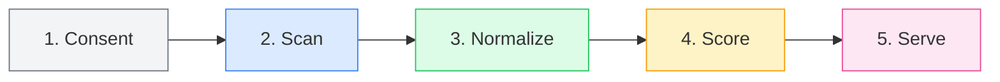
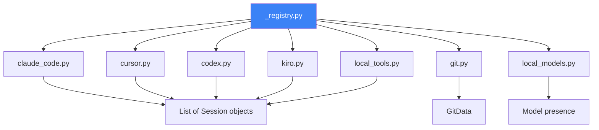
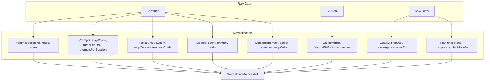
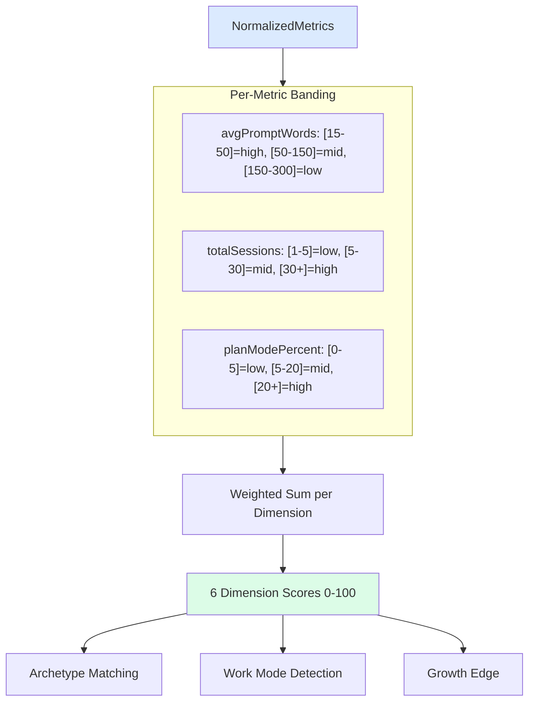
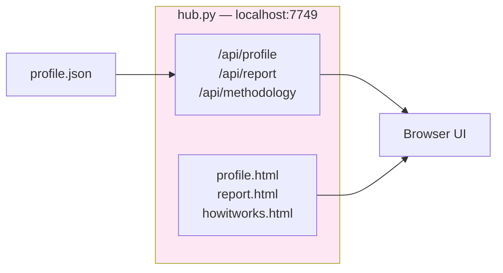
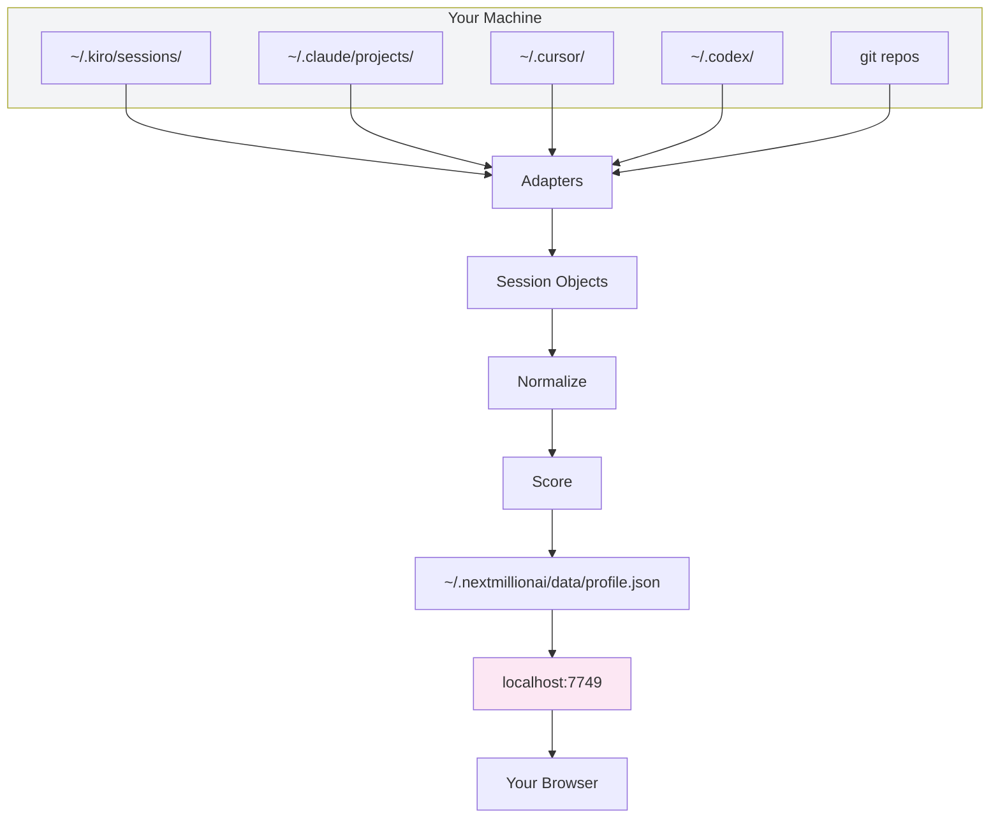

# How It Works — Full Pipeline

> From raw local files to a scored profile, in 5 stages.
> Everything runs locally. Nothing leaves your machine.

---

## The Pipeline



---

## Stage 1: Consent (`consent.py`)

Before scanning anything, the system asks which data sources to read.

```
┌─────────────────────────────────────────┐
│           Consent Prompt                 │
├─────────────────────────────────────────┤
│ claude_code   ✓ (sessions, tool calls)  │
│ cursor        ✓ (composer, AI tracking) │
│ codex         ✓ (sessions)             │
│ kiro          ✓ (CLI + IDE sessions)   │
│ git           ✓ (commit log)           │
│ local_models  ○ (opt-in)               │
│ other_tools   ✓ (aider, cline, etc.)   │
└─────────────────────────────────────────┘
```

- Stored at `~/.nextmillionai/data/consent.json`
- Each source independently togglable
- New sources added after initial calibration get a one-time prompt
- Non-interactive/CI runs: off by default (never silently enabled)

---

## Stage 2: Scan — Adapters (`adapters/`)

Each adapter reads **one AI tool's local data** and produces standardized `Session` objects.

### Adapter Registry



### What Each Adapter Reads

| Adapter | Source Path | Reads | Never Reads |
|---------|------------|-------|-------------|
| **Claude Code** | `~/.claude/projects/*/` | JSONL: timestamps, roles, tool names, models, plan mode, subagent dispatches | Prompt/response text, code |
| **Cursor** | `~/Library/.../Cursor/User/globalStorage/` | Composer history + AI code DB: sessions, per-commit AI/human line attribution | Source code, full responses |
| **Codex** | `~/.codex/sessions/` | JSONL: timestamps, models, tool calls, word counts | Prompt text, response text |
| **Kiro CLI** | `~/.kiro/sessions/cli/` | JSON metadata + JSONL transcript + history: counts, tool names, subagent links | Prompt text, response text, code |
| **Kiro IDE** | `~/Library/.../Kiro/User/globalStorage/kiro.kiroagent/` | Session JSON: message counts, models from promptLogs, autonomyMode | Prompt content, completions |
| **Git** | `git log` in each project | Commit counts, conventional-commit prefixes, languages, frameworks | Diffs, file contents, secrets |
| **Local Models** | Ollama/LM Studio/llama.cpp dirs | Installed model tags, file counts | Model weights, conversations |

### Session Object (Output of Every Adapter)

```python
@dataclass
class Session:
    tool: str                      # "kiro", "claude_code", "cursor", etc.
    session_id: str                # Unique identifier
    project_path: str | None       # Which project
    started_at: datetime | None    # When it started
    ended_at: datetime | None      # When it ended
    user_msgs: int                 # Number of user prompts
    assistant_msgs: int            # Number of AI responses
    tool_calls_by_type: dict       # {"shell": 5, "read": 12, "jira": 3}
    models: list[str]              # ["claude-sonnet-4-6", "claude-opus-4-7"]
    prompt_word_counts: list[int]  # [45, 30, 120, 25, ...] per prompt
    extras: dict                   # Tool-specific metadata
```

---

## Stage 3: Normalize + Aggregate (`scanner.py`, `aggregator.py`)

Transforms raw sessions into ~40 **normalized metrics** that the scoring engine consumes.

### Key Functions

| Function | File | Purpose |
|----------|------|---------|
| `compute_normalized()` | scanner.py | Legacy metrics from claude/cursor/codex raw dicts |
| `fold_session_metrics()` | aggregator.py | Folds kiro/codex/other deep sources into same metrics |
| `build_signal_matrix()` | aggregator.py | Per-session signal data for detailed analysis |
| `build_activity_by_day()` | aggregator.py | Daily timeline (sessions, commits, minutes) |
| `build_experimental_signals()` | aggregator.py | Lab insights (delegation funnel, prompt evolution, etc.) |
| `update_session_ledger()` | history.py | Append-only durable history |

### Normalized Metrics (~40 signals)



### Durable Ledger (`history.py`)

An append-only local store that survives session file pruning:

- Tools delete old sessions (Claude Code prunes after 30 days)
- The ledger keeps: total sessions, hours, span, subagent counts
- `max()` rule: a measured number never regresses (if you had 200 sessions last month, you still have ≥200 this month even if Claude pruned files)

---

## Stage 4: Score (`scoring.py`)

Takes normalized metrics → produces **6 dimensions**, **archetypes**, **work mode**, and **growth edge**.

### Scoring Method



### 6 Dimensions

| Dimension | What It Measures | Key Inputs |
|-----------|-----------------|------------|
| **Signal Clarity** | How well you communicate intent | avgPromptWords (optimal 15-150), firstShotAcceptRate |
| **Orchestration Range** | How many tools/models/agents you coordinate | uniqueToolCount, modelCount, mcpToolCalls, maxParallelAgents |
| **Context Command** | How you manage context across sessions | referenceUsageRate, sessions breadth, activeSurfaceCount |
| **Decision Weight** | Decision-making patterns | planModePercent, avgPlanComplexity, featureToFixRatio |
| **Recovery Velocity** | How fast you recover from errors | correctionConvergenceRate, errorFixRate |
| **Composure** | Consistency and steadiness | longestStreakDays, recentSignalDensity |

### Work Modes (8 Detected Patterns)

| Mode | Pattern |
|------|---------|
| One-Shot-Verify | Low turns, high first-shot |
| Prompt-Iterate | Medium turns, fast cycles |
| Architect-First | High plan mode, deliberate |
| Multi-Agent-Orchestrated | Subagents, parallel dispatch |
| Test-Driven-AI | Test tools prominent |
| Read-Understand-Modify | Heavy file reading before edits |
| Hybrid-Manual | Mixed AI + manual work |
| Exploration-Research | Broad exploration, many models |

### Important: Scoring Never Uses LLMs

Scores are **arithmetic** — band lookup + weighted sum. A model is only involved if the user opts into **enrichment** (narrative generation using their own API key).

---

## Stage 5: Serve (`hub.py`, `static/`)

A local-only HTTP server at `http://localhost:7749`:



| Endpoint | What It Serves |
|----------|---------------|
| `GET /api/profile` | Profile JSON (dimensions, archetypes, stats) |
| `GET /api/report` | Full report with all details |
| `GET /api/methodology` | Scoring methodology |
| `GET /api/cli` | CLI invocation path (for hydrating docs) |
| `/profile` | Interactive profile HTML page |
| `/report` | Interactive report HTML page |
| `/how-it-works` | Command reference + pipeline map |
| `/methodology` | Rendered scoring methodology |

The UI is **vanilla HTML/CSS/JS** (no framework). Both views render from the **one assessment JSON** — profile.json contains everything.

---

## End-to-End Data Flow



**Privacy boundary:** Data flows left-to-right, all within your machine. The only outbound path is `publish` (opt-in, explicit, to a registry of your choice).

---

## File Map — Primary Components

| File | Role | Lines |
|------|------|-------|
| `build_profile.py` | CLI entry + pipeline orchestrator | ~2500 |
| `scoring.py` | Dimension scoring (fingerprint-pinned) | ~1700 |
| `aggregator.py` | Signal computation, lab insights, folds | ~1200 |
| `scanner.py` | Normalized metric computation | ~400 |
| `schema.py` | TypedDicts for all data structures | ~400 |
| `hub.py` | HTTP server (API + static) | ~300 |
| `consent.py` | Source consent management | ~300 |
| `history.py` | Durable append-only ledger | ~250 |
| `paths.py` | All path constants | ~90 |
| `adapters/kiro.py` | Kiro CLI + IDE adapter | ~480 |
| `adapters/claude_code.py` | Claude Code adapter | ~400 |
| `adapters/cursor.py` | Cursor adapter | ~350 |
| `adapters/_registry.py` | Adapter discovery + execution | ~200 |

---

## What's NOT in the Pipeline

- ❌ **No network calls** during scan/score (all local files)
- ❌ **No LLM inference** for scoring (pure arithmetic)
- ❌ **No prompt text storage** (only counted signals)
- ❌ **No telemetry** (nothing phones home)
- ❌ **No cloud dependency** (works offline)
