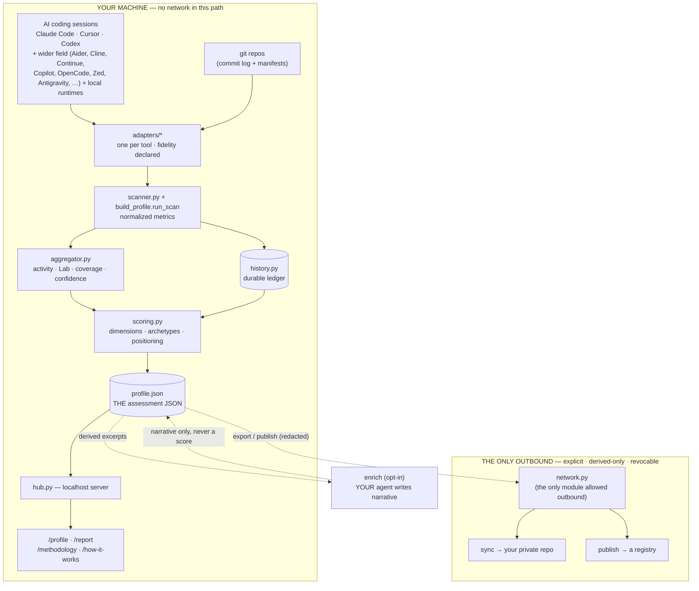

# Repo chart & flow

How nextmillionai is laid out and how data moves through it — one page,
agent- and human-readable. Module ownership lives in
[ARCHITECTURE.md](../ARCHITECTURE.md); the scoring pipeline has its own
chart in [SCORING-METHODOLOGY.md](../nextmillionai/docs/SCORING-METHODOLOGY.md#scoring-flow).

## The flow (scan → score → serve → share)

Everything in the **YOUR MACHINE** box is local and network-free
(CI-enforced). The two dashed steps below it are the only paths off the
machine — both explicit, derived-only, and revocable.

## Modules at a glance

| Module | Lives in | Does |
|---|---|---|
| **scan** | `scanner.py`, `adapters/**`, `code_intel.py`, `history.py` | Read each tool's local store; normalize; durable ledger |
| **core** | `scoring.py`, `schema.py`, `signal_registry.py`, `nextmillionai/docs/**` | Score, the one JSON contract, derived-field registry, methodology |
| **serve** | `hub.py`, `build_profile.py`, `live.py` | CLI, localhost server, live file-watcher/SSE |
| **net** | `network.py`, `network_server.py`, `sync_merge.py` | Only outbound module + reference registry + device merge |
| **face** | `static/**` | One JSON renders both views (`tabs-shared.*`) |
| **bridge** | `nextmillionai-mcp/**` | MCP server (14 tools), self-locating engine |

## Command → surface map

| Command | Reads | Writes / serves |
|---|---|---|
| `calibrate` | nothing (consent only) | `consent.json`, `collection_config.json` |
| `assess` | consented sources + ledger | `profile.json`, `scan_results.json` |
| `report` | `profile.json` | `/profile` `/report` `/methodology` `/how-it-works` |
| `enrich` | derived excerpts | narrative blocks in `profile.json` (never a score) |
| `export` | `profile.json` | static redacted artifact |
| `sync` / `publish` | derived snapshot | your private repo / a registry (opt-in) |

See [docs/agents/](agents/) for surface-by-surface specs (profile,
report, website) written for AI agents.
