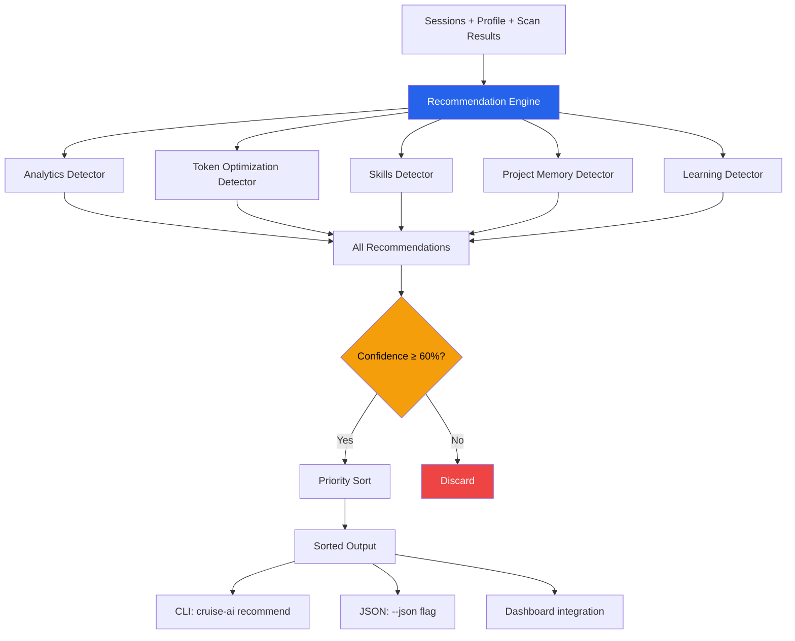

# 01 — Recommendation Engine

## Problem

Existing AI developer tools (including nextmillionai, which cruise-ai builds upon) profile what you did — sessions, tools, models, scores — but stop there. They don't tell you **what to do differently**. The single "growth edge" suggestion is static, generic, and not actionable.

Developers need:
- Evidence-based coaching that adapts to their actual patterns
- Specific, actionable next-steps (not "get better at X")
- Confidence scoring so only high-signal recommendations surface
- Privacy — coaching is personal, never shared

## Solution

A modular recommendation engine with:
- **5 category detectors** that run independently and can't crash each other
- **Confidence gating** (≥60%) — only high-evidence recommendations surface
- **Priority sorting** — high > medium > low, then by confidence
- **Dual-mode output** — every recommendation has `teach_text` (explain) and `auto_action` (do)
- **Savings estimates** — tokens/cost/time where computable

## How It Works



## Architecture

```
cruise_ai/recommendations/
├── __init__.py          # Public API: recommend(), Recommendation
├── types.py             # Recommendation dataclass, CONFIDENCE_THRESHOLD
├── engine.py            # Orchestrator: runs detectors, gates, sorts
├── analytics.py         # Usage, cost, timeline detectors
├── token_optimization.py # Duplicate context, long prompts, model routing
├── skills.py            # Tool patterns, co-occurrence, underutilization
├── project_memory.py    # Repeated context, cross-session patterns
└── learning.py          # Plan mode, subagents, context engineering
```

## Key Design Decisions

| Decision | Rationale |
|----------|-----------|
| Detectors wrapped in try/except | One broken detector never crashes the whole engine |
| Confidence threshold of 60% | Balances coverage vs noise — below 60% is too speculative |
| Priority + confidence dual sort | High-priority at top even if medium-confidence; within same priority, most confident first |
| No detector shares state | Pure functions, no side effects, fully parallelizable |
| `savings_estimate` is always optional | Not all recommendations have quantifiable savings |

## Usage

```bash
# Get all recommendations
cruise-ai recommend

# Filter by category
cruise-ai recommend --category token_optimization

# Machine-readable output
cruise-ai recommend --json

# Raise confidence bar
cruise-ai recommend --min-confidence 80
```

### Python API

```python
from cruise_ai.recommendations import recommend, Recommendation

recs: list[Recommendation] = recommend(sessions, profile, scan_results)

for rec in recs:
    print(f"[{rec.priority}] {rec.headline}")
    print(f"  Confidence: {rec.confidence}%")
    print(f"  Action: {rec.action_type}")
    print(f"  Teach: {rec.teach_text}")
```

## Extending

Add a new category:

1. Create `cruise_ai/recommendations/my_category.py`
2. Implement `def detect(sessions, profile, scan_results) -> list[Recommendation]`
3. Import in `engine.py` and add to the detector list
4. Add tests in `tests/test_recommendations.py`
