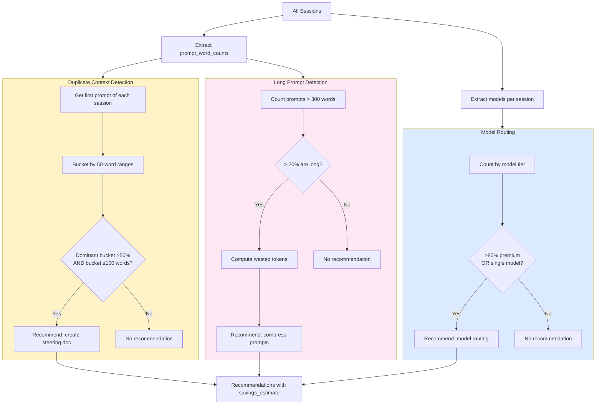

# 02 — Token Optimization

## Problem

Developers waste significant tokens (and money) through three patterns they often don't realize:

1. **Duplicate Context** — pasting the same project context into every new session
2. **Long Prompts** — writing 400-700 word prompts when 50-150 is optimal
3. **Wrong Model** — using opus/gpt-4 for tasks that sonnet/haiku handles equally well

These patterns compound: a developer with 50 sessions/month wasting 300 tokens/prompt × 20 prompts/session = 300,000 wasted tokens/month (~$2-15 depending on model).

## Solution

Three detectors that analyze prompt word count distributions from session data:

| Detector | Signal | Threshold | Action |
|----------|--------|-----------|--------|
| **Duplicate Context** | First-prompt lengths cluster at same range across sessions | >50% of sessions start with similar-length (±50 words) prompts ≥100 words | Suggest steering doc |
| **Long Prompts** | Prompt word count exceeds optimal range | >20% of prompts exceed 300 words | Suggest compression |
| **Model Routing** | Model usage concentration | >80% on premium models OR single-model usage across 20+ sessions | Suggest multi-model routing |

## How It Works



## Savings Calculation

```
Duplicate Context:
  wasted_per_session = dominant_bucket_words × 0.7 × 1.3 tokens/word
  total_wasted = wasted_per_session × affected_session_count

Long Prompts:
  excess_per_prompt = (avg_long_prompt_words - 150) × 1.3 tokens/word
  total_wasted = excess_per_prompt × long_prompt_count

Model Routing:
  potential_savings = expensive_model_cost × 0.7 (70% could use cheaper)
```

## Example Output

```
🔴 [1] 65% of prompts exceed 300 words — likely wasting tokens
     Category: Token Optimization | Confidence: 80%
     97 of 150 prompts are over 300 words (avg 425 words for the long ones).
     Estimated ~44,525 excess tokens. Consider: steering docs for repeated
     context, or prompt compression.
     💾 Est. savings: 44,525 tokens/period

🟡 [2] 70% of sessions start with ~200-250 word prompts — likely duplicate context
     Category: Token Optimization | Confidence: 70%
     14 of 20 sessions begin with similar-length prompts (~200 words),
     suggesting the same context is pasted repeatedly.
     💾 Est. savings: 25,480 tokens/period

🟡 [3] 100% of usage is on premium models — try routing simple tasks to cheaper ones
     Category: Token Optimization | Confidence: 75%
```

## Usage

```bash
# See all token optimization recommendations
cruise-ai recommend --category token_optimization

# Get JSON for integration
cruise-ai recommend --category token_optimization --json
```

## Teach Mode Explains

When a user asks "Why this?", the system explains:

> **Long prompts often repeat context the AI already knows.**
> Steering docs (.kiro/steering/, CLAUDE.md, .cursorrules) provide context automatically — no need to paste it every time.

> **Not every task needs the most powerful model.**
> Simple tasks (formatting, typo fixes, boilerplate) work equally well with faster, cheaper models.
