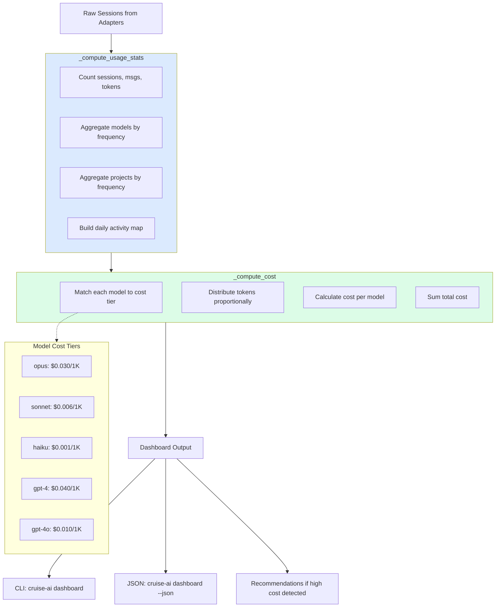

# 03 — AI Usage Dashboard & Cost Dashboard

## Problem

Developers have no visibility into:
- How much they actually use AI tools (sessions, prompts, tokens)
- What it costs them (per model, per project)
- Which models and tools they use most
- How their usage distributes across projects

Without visibility, there's no baseline for improvement.

## Solution

A local analytics dashboard computed from session data:

| Metric | Source | Calculation |
|--------|--------|-------------|
| Total sessions | Adapter session count | Direct count |
| Total prompts | Session `user_msgs` | Sum across sessions |
| Total tokens (est.) | `prompt_word_counts` × 1.3 | Prompt tokens + estimated response tokens (4× prompt avg) |
| Cost estimate | Tokens × model cost/1K | Per-model breakdown |
| Models | Session `models` field | Count by model name |
| Projects | Session `project_path` | Count by project |
| Daily activity | Session `started_at` | Grouped by date |

## How It Works



## Cost Model

Approximate costs per 1K tokens (blended input/output):

```python
MODEL_COSTS_PER_1K = {
    "claude-opus": 0.030,
    "claude-sonnet": 0.006,
    "claude-haiku": 0.001,
    "gpt-4o": 0.010,
    "gpt-4": 0.040,
    "gpt-3.5": 0.001,
    "o1": 0.030,
    "gemini-pro": 0.004,
    "gemini-flash": 0.001,
    "deepseek": 0.002,
}
```

Token estimation: `word_count × 1.3 ≈ token_count`

## Example Output

```
  ── cruise-ai dashboard ──

  📊 Usage
     Sessions:            436
     Prompts:           3,901
     Responses:        17,383
     Tokens (est.):   847,230
     Avg prompt len:       32 words

  💰 Cost Estimate
     Total: ~$12.47
     claude-opus-4-7: ~$7.48
     claude-sonnet-4-6: ~$3.11
     claude-haiku-4-5: ~$1.88

  🤖 Models
     claude-opus-4-7: 249 sessions
     claude-sonnet-4-6: 248 sessions
     claude-haiku-4-5: 248 sessions

  🔧 AI Tools
     kiro: 311 sessions
     claude_code: 125 sessions

  📁 Top Projects
     cruise-ai: 89 sessions
     nextmillionai: 67 sessions
     ai-native-pdlc-kit: 45 sessions
```

## Usage

```bash
# Terminal dashboard
cruise-ai dashboard

# JSON output (pipe to jq, integrate with other tools)
cruise-ai dashboard --json

# Cost recommendations specifically
cruise-ai recommend --category analytics
```

## JSON Schema

```json
{
  "usage": {
    "total_sessions": 436,
    "total_prompts": 3901,
    "total_responses": 17383,
    "total_tokens_estimated": 847230,
    "avg_prompt_words": 32
  },
  "cost": {
    "total_estimated_cost_usd": 12.47,
    "by_model": {
      "claude-opus-4-7": 7.48,
      "claude-sonnet-4-6": 3.11
    },
    "tokens_total": 847230
  },
  "models": {"claude-opus-4-7": 249, ...},
  "projects": {"cruise-ai": 89, ...},
  "tools": {"kiro": 311, ...},
  "daily": {"2026-07-15": {"sessions": 3, "prompts": 45}, ...}
}
```
