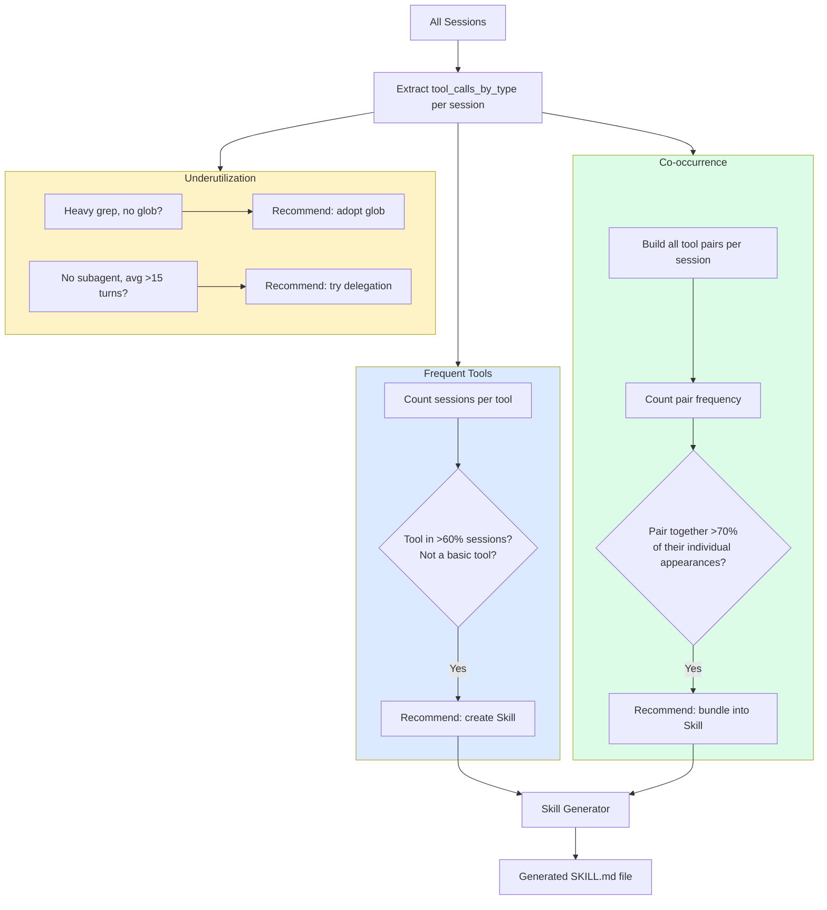

# 04 — Skill Recommendation & Generator

## Problem

Developers repeat the same workflows across sessions without codifying them:
- Same tools used in the same order every time
- Same tool combinations always appearing together
- Available tools never discovered (e.g., glob vs grep, subagents)
- No reusable instruction sets for recurring patterns

This leads to: repeated setup prompts, inconsistent results, and missed efficiency gains.

## Solution

Three detectors + a generator:

| Component | What It Does |
|-----------|-------------|
| **Frequent Tool Detector** | Flags tools used in >60% of sessions (excluding basics like read/write/shell) |
| **Co-occurrence Detector** | Finds tool pairs that always appear together (>70% co-occurrence) |
| **Underutilization Detector** | Identifies available-but-unused tools and delegation opportunities |
| **Skill Generator** | Produces a structured SKILL.md file from detected patterns |

## How It Works



## Detection Logic

### Frequent Tools (>60% sessions)

```python
# Exclude basics that every session uses
BASIC_TOOLS = {"read", "write", "shell", "grep", "glob"}

for tool in sessions_with_tool:
    if sessions_with_tool[tool] / total_sessions > 0.6:
        if tool not in BASIC_TOOLS:
            → Recommend Skill
```

### Co-occurrence (>70% overlap)

```python
for (tool_a, tool_b), together_count in co_occurrences:
    min_individual = min(count_a, count_b)
    if together_count / min_individual > 0.7:
        → Recommend bundled Skill
```

### Underutilization Patterns

| Pattern | Detection | Recommendation |
|---------|-----------|---------------|
| Search without discovery | grep > 20, glob = 0 | "Try glob for batch file discovery" |
| No delegation | task/dispatch = 0, avg turns > 15, sessions > 20 | "Try subagent delegation" |

## Generated Skill Format

```markdown
# Jira Workflow

Automate Jira ticket management

## When to Use
- When working with: jira, confluence
- Create ticket, link to PR, update documentation

## Instructions

When this skill is active:

1. Always use the following tool sequence: jira → confluence
2. Create ticket, link to PR, update documentation

## Tools Required
- `jira`
- `confluence`
```

## Example Output

```
🟡 [1] Tools jira, confluence, gitlab used in 60%+ of sessions — consider a Skill
     Category: Skills | Confidence: 72%
     These tools appear consistently across most sessions:
     jira (15/20 sessions), confluence (13/20 sessions), gitlab (12/20 sessions).
     A Skill file would standardize how these are used.

🟡 [2] jira + confluence always used together — bundle into a Skill
     Category: Skills | Confidence: 68%
     These tools co-occur in 12 sessions (85% co-occurrence rate).

🟡 [3] No subagent delegation — your sessions avg 18 turns, consider dispatching
     Category: Skills | Confidence: 68%
```

## Usage

```bash
# See skill recommendations
cruise-ai recommend --category skills

# Generate a skill (from auto_action)
# Future: cruise-ai skill generate --name "jira-workflow"
```

## Teach Mode

> **A Skill is a reusable instruction set that tells your AI tool HOW to use specific tools or follow specific patterns.** Instead of re-explaining your workflow each session, a Skill encodes it permanently.

> **When tools are always used together, a Skill can encode the entire workflow** — reducing prompts and ensuring consistency.
