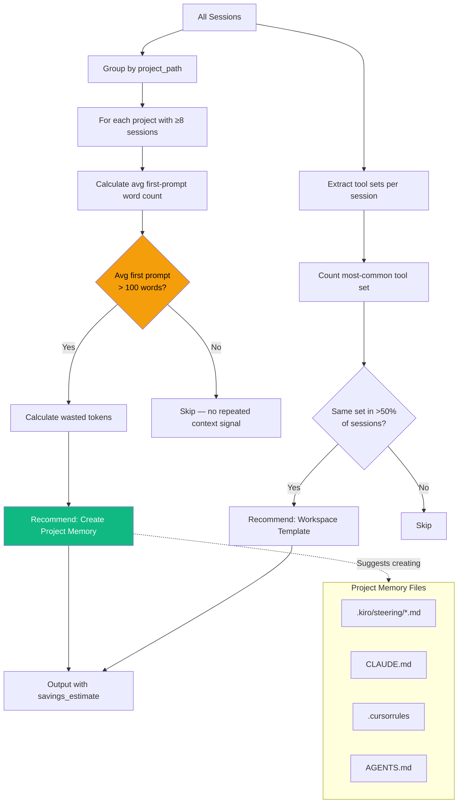

# 05 — Project Memory Recommendation

## Problem

When working on the same project across many sessions, developers re-explain context every time:
- "This project uses React + TypeScript with a specific component pattern..."
- "The database schema has these tables..."
- "Our coding standards require..."

This repeated context wastes tokens and time. With 15 sessions on one project, each with a 200-word context preamble: that's 15 × 200 × 1.3 = **3,900 tokens wasted** on what the AI should already know.

## Solution

Two detectors that identify when project memory would save effort:

| Detector | Signal | Threshold |
|----------|--------|-----------|
| **Project Concentration** | Same project, many sessions, large first prompts | ≥8 sessions with avg first prompt >100 words |
| **Cross-session Patterns** | Same tool set repeated regardless of project | >50% of sessions share identical tool configuration |

## How It Works



## Savings Calculation

```
repeated_tokens = avg_first_prompt_words × 0.6 × 1.3 × session_count
                                            ↑         ↑         ↑
                                    likely repeated  tokens/word  how many times
```

Example: 12 sessions × 200 words × 0.6 × 1.3 = **1,872 tokens saved**

## What Gets Recommended

Based on the detected AI tool:

| Tool | Recommended File | Purpose |
|------|-----------------|---------|
| Kiro CLI | `.kiro/steering/*.md` | Always-loaded steering docs |
| Kiro IDE | `.kiro/steering/*.md` | Same mechanism |
| Claude Code | `CLAUDE.md` | Project memory |
| Cursor | `.cursorrules` | Custom instructions |
| Any tool | `AGENTS.md` | Multi-agent architecture docs |

## Example Output

```
🔴 [1] Project 'cruise-ai' has 15 sessions with ~180-word first prompts — needs project memory
     Category: Project Memory | Confidence: 75%
     Across 15 sessions in 'cruise-ai', the average first prompt is 180 words.
     This suggests you're re-explaining project context each time.
     A project memory file would eliminate this repetition.
     💾 Est. savings: 2,106 tokens/period

🟢 [2] Same tool configuration in 12/18 sessions — create a workspace template
     Category: Project Memory | Confidence: 65%
     Tools [grep, jira, read, shell, write] appear together in 12 of 18 sessions.
```

## Usage

```bash
# See project memory recommendations
cruise-ai recommend --category project_memory

# Teach mode explanation
cruise-ai teach context_engineering
```

## Teach Mode Explains

> **Project memory is persistent context your AI tool loads automatically:**
> - `.kiro/steering/*.md` — Kiro steering docs
> - `CLAUDE.md` — Claude Code memory
> - `.cursorrules` — Cursor rules
> - `AGENTS.md` — Multi-agent project docs
>
> **Include:** architecture decisions, coding standards, key file locations, domain terminology, and project-specific patterns.
