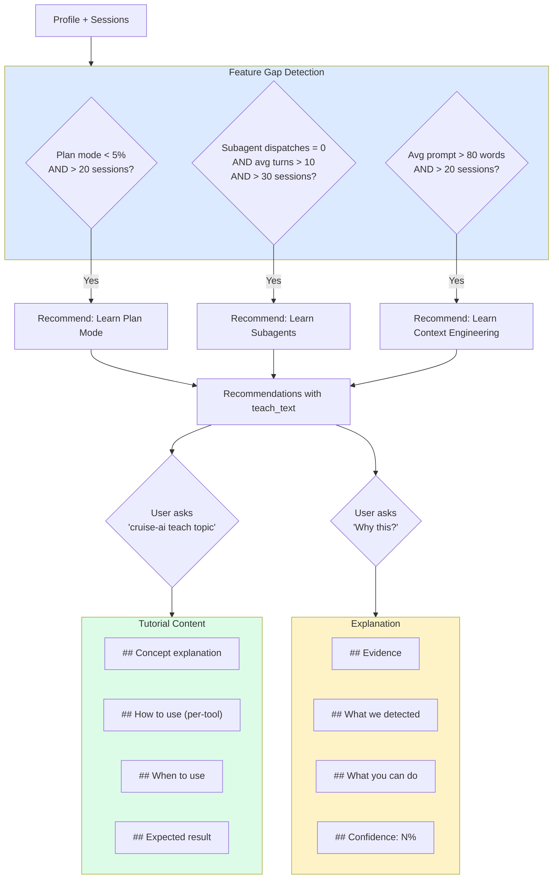

# 06 — Learning Engine

## Problem

AI coding tools have powerful features (plan mode, subagents, steering docs, skills) that most developers never discover because:
- Documentation is scattered and passive
- No one tells you "you'd benefit from X" based on your actual usage
- No explanation of WHY a specific feature is recommended for YOUR patterns
- No path from "I don't know this exists" → "I use this daily"

## Solution

A dual-mode learning system:

| Mode | Behavior | Trigger |
|------|----------|---------|
| **Teach Me** | Step-by-step tutorials, explains concepts | `cruise-ai teach <topic>` |
| **Why This?** | Explains why a specific recommendation was made | Built into every recommendation's `teach_text` |
| **Do It For Me** | Auto-generates the artifact | Every recommendation's `auto_action` |
| **Explain Changes** | Explains what was generated and why | Post-generation explanation |

## How It Works



## Detection Rules

| Feature | Detection Signal | Confidence | Priority |
|---------|-----------------|------------|----------|
| Plan Mode | `planModePercent < 5%` AND sessions > 20 | 70% | medium |
| Subagents | `subagentDispatches = 0` AND `avgPromptsPerSession > 10` AND sessions > 30 | 68% | medium |
| Context Engineering | `avgPromptWords > 80` AND sessions > 20 | 65% | medium |

## Tutorial Content

### Available Topics

```bash
cruise-ai teach                      # List all topics
cruise-ai teach plan_mode            # Plan Mode tutorial
cruise-ai teach subagents            # Subagent Delegation tutorial
cruise-ai teach context_engineering  # Context Engineering tutorial
cruise-ai teach skills               # Kiro Skills tutorial
```

### Tutorial Structure

Each tutorial follows the same format:
1. **What** — concept explanation in one paragraph
2. **How** — per-tool usage instructions (Kiro, Claude Code, Cursor)
3. **When** — specific situations where it applies
4. **Result** — what changes in your workflow

## Why This? API

Every recommendation carries a `teach_text` field that answers "why was this recommended for me?":

```python
from cruise_ai.recommendations.learning import explain_recommendation

explanation = explain_recommendation(rec)
# Returns:
# ## Why This Recommendation?
# **{headline}**
# ### Evidence
# {evidence from your data}
# ### What We Detected
# {detail}
# ### What You Can Do
# {teach_text}
# ### Confidence: {N}%
```

## Example Output

### Recommendation
```
🟡 [1] You rarely use plan mode — it can reduce iteration cycles
     Category: Learning | Confidence: 70%
     Plan mode usage: 2.1%. Plan mode lets the AI outline its approach
     before executing — catching misunderstandings before they become
     multi-turn correction loops.
```

### Teach Command
```
  ── cruise-ai teach: plan_mode ──

  Plan Mode
  ─────────
  Ask the AI to outline steps before executing.

  Usage:
    Kiro:         /plan  or 'Plan first:'
    Claude Code:  'Think step by step' or 'Plan before acting'
    Cursor:       'Outline the approach first'

  When to use:
    ✓ Multi-file refactors    ✓ Architecture changes
    ✓ Complex features        ✓ When you want to review first

  Result: Fewer correction cycles, fewer wasted tokens.
```

## Usage

```bash
# See what you should learn next
cruise-ai recommend --category learning

# Go through a tutorial
cruise-ai teach plan_mode

# Understand why something was recommended
cruise-ai recommend --json | jq '.[0].teach_text'
```

## Design Philosophy

1. **Evidence → Suggestion → Tutorial** — never suggest learning something without evidence it would help
2. **Per-tool instructions** — always translate concepts into the specific tool the user uses
3. **No shame** — recommendations are framed as opportunities, never failures
4. **Progressive** — start with the highest-impact, lowest-effort feature gaps
