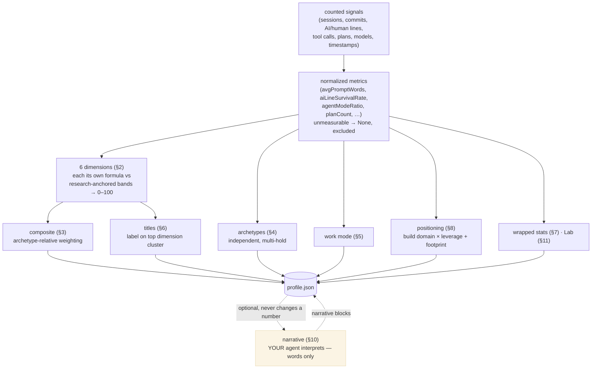

# nextmillionai — Scoring Methodology

How nextmillionai measures how you build with AI. Every score, archetype, work
mode, title, and **positioning** is derived from observable signals in **your local
AI coding sessions and git history** — Claude Code, Cursor, and Codex first-class,
plus a wider field of editors, CLIs, and local model runtimes (full list in §1) —
never from resumes, self-reported skills, social profiles, or any uploaded data. The scoring
engine implements [`TAXONOMY.md`](../../TAXONOMY.md); when the taxonomy changes, this
file follows.

**Methodology version:** `0.4.4` · aligns with taxonomy `0.2.1` · schema `1.1`
· Formula fingerprint: `14c2e9746c5b` *(version-stable source hash of the scoring
engine — CI fails if scoring code changes without this doc being deliberately
revisited; refresh via `python3 scripts/formula_fingerprint.py --update`)*

---

## Privacy model — two promises (read first)

These are two different commitments. We state both, because they are not the same:

1. **Your code and data never reach nextmillionai.** We have no server and no
   upload path — it is structurally impossible for your sessions, code, prompts,
   scores, or narratives to come to us. (This is the promise YC's Paxel broke: its
   payload of scores, narratives, redacted decisions, and session metadata was
   uploaded to YC.)
2. **Your assessment is computed entirely from local files on your machine** — your
   AI coding sessions and local git. Reading those is on-disk; nothing leaves.

Nuance we never overclaim:
- **Links** you add (GitHub, LinkedIn, site) are display-only strings shown on your
  profile. We do not fetch them, and they never feed a score.
- **"Add a previous project"** means point at a *local clone*; we read it on disk.
- Any **remote fetch** (e.g. a GitHub API call) would be a request from *your*
  machine to *that third party* — never to us — and must be explicit, opt-in, and
  labelled. It is not in the beta.

So "nothing leaves your machine" holds for the default local flow. The always-true
public line is promise #1 plus *"computed entirely from local files."*

---

## Principles

These commitments constrain every formula below:

1. **No builder type is ranked above another.** A rapid prototyper who one-shots
   working software through agents and an architect who plans for a week are
   *different*, not better-and-worse. Building heavily *with* agents is a strength,
   never a penalty.
2. **Scoring is archetype-relative.** You are measured against excellence *in how
   you build*, not against a single traditional-engineer ideal.
3. **Agent leverage is a positive signal.** High AI co-authorship, agent-mode
   ratio, parallel agents, and one-shot success raise your AI-native reading.
4. **Honest about gaps.** A signal we cannot measure from your data is marked
   *insufficient* and excluded — never estimated, never faked.
5. **Descriptive, not a leaderboard.** The map locates you; it does not rank you.
6. **Positioning is a map, not a ladder.** Where you sit (what you build × how much
   leverage you operate at) is identity, not score. Higher leverage is *fit, not
   better* — it pays off on decomposable, repeatable work, costs more tokens, and
   staying at hands-on prompting is the correct choice for tightly-coupled work.
7. **No percentiles or peer rankings.** There is no cohort. "Good" is anchored to
   research-derived bands (see [`THESIS.md`](../../THESIS.md)), never to other people.

---

## Who this is calibrated for

These scores are calibrated for **people who build software with AI** — software
developers and AI engineers. Every signal is read from your AI coding tools (the
full set is in §1) and git history, and every band is anchored to research on
software developers (see [`THESIS.md`](../../THESIS.md) and
[`docs/REFERENCES.md`](../../docs/REFERENCES.md)).

If you build with AI in other ways — no-code tools, design, product, research —
this assessment is **not yet calibrated** for your work, and the numbers won't mean
what they're meant to. That is a *not yet*, not a verdict: widening the calibration
is on the roadmap. Consistent with Principle 1, this is about what the measurement
is *valid for* — never a hierarchy of builders.

---

## Architecture overview

```
scan  →  normalize  →  score  →  locate  →  narrate
(local sessions   (metrics)   (dimensions,   (positioning:   (work mode,
 + git)                        archetypes,    build domain ×  wrapped stats,
                               work mode,     leverage,       growth edge,
                               titles)        tech domains)   enrichment)
```

Everything runs locally. The shareable profile contains derived numbers only.

### Scoring flow



Every box except the dashed **narrative** node is arithmetic — no model
decides a number. The narrative is the only place a model is used, it runs
on the user's own agent, and it can never change a score, title, or
positioning value (§ *Where a model does and does not come in*).

---

## The three layers

nextmillionai reports you in three distinct layers — keep them separate:

- **Quality — *how well* you build.** The six dimensions (§2). Arithmetic over
  counted signals against research-anchored bands.
- **Style — *how you behave* in a session.** Archetypes (§4) and work modes (§5).
- **Positioning — *where you sit and what you build*.** The map (§8): build domain ×
  leverage mode, plus a tech-domain tag. Identity, not a score.

---

## Where a model does (and does not) come in

The scores are **measurements, not opinions — no model required.** Every number,
archetype, work mode, title, and positioning value is arithmetic over signals the
scanner counts in your real sessions and git: how much AI-written code survives in
commits, how often you plan before coding, how many models and parallel agents you
run, prompt characteristics, recovery behavior, which frameworks and SDKs appear in
your repos, and so on. Each signal feeds a fixed formula with research-anchored
bands; the title is the label on your highest-scoring dimension cluster, read from a
fixed table. No language model decides any of this — the counters do, and the rules
are transparent, reproducible, and auditable.

**Honest limit:** these are *proxies*. "Plans before coding" is a real, countable
behavior, but it stands in for decision quality — not decision quality itself. Where
a behavior cannot be measured, it is marked *insufficient* and excluded.

**The narrative is interpretation — the only place a model is used, and it runs on
the user's own agent.** The scanner can count that you wrote 85 plans; it cannot
write "you constrain agents around production risk and redirect vague reviews into
sharper scopes," or name the move "Enforce Safety Rails" and point to the PR. That
model is the user's own agent (via MCP or `nextmillionai enrich`), never a server of
ours, and it is optional. The narrative **never changes a score, title, or
positioning value** — it explains how you earned them. Everything stands with the
model switched off.

---

## 1. Data collection

We read far more than the three first-class tools. Every adapter declares a
**fidelity tier** — `deep` (real session boundaries + timestamps parsed),
`counts` (countable artifacts, no parseable sessions), or `presence` (install
detectable, usage marked *insufficient*). Counts/presence sources never invent
sessions and never move a score. The canonical, per-layout contract is
[`docs/ADAPTERS.md`](../../docs/ADAPTERS.md).

| Source | Tier | Reads | Signals |
|--------|------|-------|---------|
| Claude Code (`~/.claude/projects/`) | deep | JSONL transcripts + subagent runs | messages, roles, models, tool-call names, timestamps, real `cwd`, plan mode, dispatches |
| Cursor (`~/.cursor/`) | deep | `ai-code-tracking.db`, plans, composer history (all storage generations) | AI/human/composer lines, AI%, modes, plans |
| Codex (`~/.codex/sessions/`) | deep | session files | messages, models, tool calls, timestamps |
| Git (discovered repos) | deep | log + config files | commits, branches, languages/frameworks |
| Wider field — Aider, Cline, Continue.dev, Copilot Chat, Zed AI | deep | each tool's own local session files | sessions, message counts, timestamps, models |
| Wider field — Windsurf, Cody | counts | store file counts + last activity | presence + activity (sessions *insufficient*) |
| JetBrains AI | presence | IDE config markers | install only (chat not locally parseable) |
| Local runtimes — Ollama, LM Studio | counts | model tags, history/conversation file counts | installed models, usage counts |
| llama.cpp | presence | GGUF model cache | model presence (no usage log) |
| Claude Desktop *(opt-in, default off)* | presence | install + MCP config names | when enabled, its MCP servers count toward the deduped MCP signal (names stay local) |
| Custom adapters *(user-registered)* | counts | paths you declare in `nextmillionai.config.json` | file-per-session timestamps or presence |
| **Local code scan** *(experimental, opt-in `--code`)* | — | repo files on disk | structure, manifests/deps, tests/docs presence, repetition, deploy configs, complexity hotspots — **metrics only; code is never stored or transmitted** |

Project attribution uses the real working directory recorded in the session — not a
decoded storage-folder name — so hyphenated project names resolve correctly across
macOS, Linux, and Windows.

All reads are on-disk and local. The code scan is opt-in, off by default, feeds
`buildDomain` and the experimental code-intelligence signals, and stores derived
metrics only — never source.

### Normalized metrics

Raw signals are normalized into metrics (e.g. `avgPromptWords`,
`aiLineSurvivalRate`, `agentModeRatio`, `mcpServerCount`, `maxParallelAgents`,
`planCount`, `featureToFixRatio`). Metrics that cannot be derived resolve to `None`
and are excluded — they do not default to a value.

---

## Measurement taxonomy — direct, indirect, and provenance

Every number is one of two kinds, and carries an honest provenance label.

- **Direct** measures are counted facts — true by definition of what was observed
  (subagent dispatches, AI lines survived in commits, sessions, commits, models).
- **Indirect** measures are derived — a ratio, a 0–100 score, a classification, or
  an estimate. The chain is always: *counted signals → normalized metrics → a
  scaling function (see Helper functions below) → a score or class.* Unmeasurable
  inputs are insufficient and excluded, never defaulted.

Each number also declares its **provenance** — what *kind* of claim it is:

- **measured** — a direct count or ratio, true by definition.
- **research-anchored** — the construct or its anchor traces to a cited study.
- **reasoned-default** — a sensible chosen constant, *not* externally validated,
  openly versioned, recalibrated as data accrues. An honest default, not a hidden
  assumption — these are the [open questions](#open-questions).
- **estimate** — an explicitly labeled band, never sold as an exact measurement.

This is deliberate. Measuring *how* people build with AI is a young field, and we
have no cohort to validate thresholds against — nor would we, since ranking against
other people is a [hard line](#principles). So meaning comes from **construct
validity + transparency + honest provenance**, never from statistical validation we
cannot have. Reasoned-defaults are owned as such, not dressed up as measurements.

The **exhaustive per-metric reference** — every number's exact code logic,
reasoning, provenance, and citation — is
[`docs/methodology/DERIVATIONS.md`](methodology/DERIVATIONS.md). It is *generated*
from the same machine-readable registry (`nextmillionai/methodology_spec.py`) that
drives the `/methodology` explorer and is guarded against the engine, so the doc,
the UI, and the code cannot disagree. The sections below give the construct-level
account; that file gives the per-number detail.

---

## 2. The six dimensions

Each scores 0–100 against research-anchored bands. Scores are descriptive; their
*contribution* to the composite is archetype-relative (§3).

| Dimension | Measures | Key signals | Status |
|-----------|----------|-------------|--------|
| **Signal Clarity** | precision of direction | prompt specificity, iterations-to-accept, avg prompt words | promoted |
| **Build Stability** | whether AI code holds up *in your context* | git churn / revert rate, post-edit stability | promoted |
| **Decision Weight** | weight & durability of decisions | decision impact, decisions that stick, plan signals *(weighted by work mode — §3)* | promoted |
| **Recovery Velocity** | recovering from AI error | debug-vs-generate ratio, error→fix convergence | promoted |
| **Context Command** | carrying context across tools/sessions | reference & rules usage, **MCP/context bridging (v0.4.4; servers across all clients + tool-call usage, reward-only)**, session continuity, **cross-surface usage breadth (v0.4.0; parsed sessions only, never installs)**, *retrieval/RAG (sub-signal)* | promoted |
| **Orchestration Range** | tools/models/agents coordinated | tool count, **MCP servers**, **max parallel agents**, **subagent dispatches (v0.4.0; ledger-backed)**, model routing | promoted |

### Helper functions
`linear(x, lo, hi)` maps a value into 0–100; `inverse(x, lo, hi)` does the same for
"lower is better" metrics; both clamp to [0, 100]. A dimension built only from
`None` inputs returns `None` (insufficient), not 0.

**Important:** planning signals feed Decision Weight **only** — never Context
Command or System Thinker as universal virtues. Absence of plan files is normal for
one-shot / prototyping modes and is not penalized there.

---

## 3. Composite — archetype-relative

```
composite = Σ(dimension_score × weight_for_your_mode) / Σ(weights of scored dimensions)
```

Dimension weights adapt to your dominant work mode / archetype so the composite
reflects excellence *in how you actually build*:

| Dominant mode | Up-weighted | Down-weighted |
|---------------|-------------|---------------|
| Rapid Prototyper / One-Shot-Verify | Signal Clarity, Orchestration Range, Recovery Velocity | Decision Weight, Build Stability |
| Architect-First / System Thinker | Decision Weight, Context Command | (balanced) |
| Production Guardian / Test-Driven | Build Stability, Recovery Velocity | (balanced) |
| Multi-Agent Orchestrated | Orchestration Range, Context Command | Decision Weight |

Weights renormalize over only the dimensions with data, so missing inputs lower
`dataCompleteness` rather than dragging the score toward zero. The composite is a
**strength index for your mode**, not a ranking against other builders.

---

## 4. Archetypes (independent, multi-hold)

Each uses its own formula over relevant metrics and skips missing inputs. Levels:
Elite ≥85, Advanced ≥70, Proficient ≥55, Developing ≥35, Emerging <35.

**Frontier:** Agent Harness Builder · Integration / MCP Engineer · Multi-Agent
Orchestrator · Context Engineer · Eval-Driven Builder · Production Guardian · AI
Product Engineer **Application:** System Thinker · **Rapid Prototyper** · Code
Weaver **Foundation / specialist:** Model Trainer · Data / Pipeline Engineer · Model
Router

Rapid Prototyper and Multi-Agent Orchestrator are first-class identities — high
agent leverage and one-shot success score them *up*.

---

## 5. Work modes — "how you build"

One dominant, others secondary, classified from signals you already produce:
Architect-First · Prompt-Iterate · One-Shot-Verify · Read-Understand-Modify ·
Test-Driven-AI · Multi-Agent-Orchestrated · Hybrid-Manual · Exploration-Research.
Surfaced in plain language. No mode is "better."

---

## 6. Titles
Derived from archetype scores — single-archetype primaries at ≥80, combination
titles at thresholds, plus a rare legendary title for breadth at high levels. Titles
describe range and depth, not rank between builder types.

**Baseline kind — AI Explorer.** Everyone with any measured AI activity holds the
baseline kind *AI Explorer* until a craft specializes. It is the *entry craft, not a
lesser rung* — a builder who has started but not yet crossed a threshold is an AI
Explorer, never "no kind". A specialized kind always outranks the baseline for the
primary title; the baseline only surfaces as primary when no craft has reached its
threshold. (Truly no measured signal → no kind, honestly insufficient.)

---

## 7. Wrapped stats (signal cards)
Heuristic, computed from transcripts: max parallel agents · longest session ·
plan-mode % · prompts/session · avg prompt words · ship streak · deep-session count
· features vs fixes · go-to prompt · tools · models · active hours. Reported
neutrally (e.g. plan-mode % is shown, not graded), each with a plain-language *what
it means* and *how it's measured*, scoped to the selected window.

---

## 8. Positioning — the map (build domain × leverage)

The map **locates** a builder without ranking. Old prestige axes and their penalties
are gone.

- **X — Build domain (Products ↔ AI-systems):** are you building general products,
  AI-powered products, or the AI systems themselves (agents, harnesses, multi-agent
  infra)? **v0.4.0:** classified per repo — agent framework / MCP infrastructure →
  `ai_systems`; an LLM SDK *or raw model-API integration* wired behind product code →
  `ai_products`; neither → `products`. Default scan classifies from declared
  dependencies (incl. one level of monorepo workspace manifests); the opt-in
  `--code` scan verifies **import lines + call sites** and demotes a declared-but-
  never-imported SDK (presence is not usage). `buildDomain.primary` is the
  commit-weight-dominant column — a map reading, never a "highest tier" — and
  `buildDomain.distribution` carries the full share per column, so a builder
  shipping products AND AI-products shows mass in both.
- **Y — Leverage mode (Prompting ↔ Designs-the-loop):** how much you leverage AI to
  build. **v1 = three stages:** *Prompting* (direct the agent turn by turn) →
  *Harnessing* (rules, MCPs, hooks, persistent context around the agent) → *Designs
  the loop* (a state file + self-feeding / scheduled runs, up to orchestrating
  multiple agents). Orchestrating / multi-agent is a sub-flavor *inside* "Designs the
  loop," not a separate rung.

The older labels survive as **sub-labels** where they add nuance (Explorer/Architect
on the build axis, Solo/Orchestrator on the leverage axis).

A **tech-domain tag** (TypeScript/React, Swift, Java, Python/ML, Go…) reports where
you operate, as a share-of-activity breakdown. Pure signal — no stack ranked above
another.

No archetype or stage subtracts from any axis. Position is identity, not score. The
leverage **map visual** (a "you are here" dot + a "nearest expansion" arrow, no
numbering) is shown in the **report only**; the profile carries positioning as
neutral tags. Grounded in current practice (the "loops" discourse), not invented —
and every expansion suggestion carries the *fit, not better / ~15× tokens /
decomposable-only* caveat.

---

## 9. Growth edge — archetype-aware
Next moves are drawn from your own sessions and matched to your mode. A fast shipper
is pointed at "tighten verification after the agent reports back," never "write more
plans." Growth never means "build more like a traditional engineer." Growth /
improvement areas default to **private** ("only visible to you") and are excluded
from the shareable profile and export.

---

## 10. Decision patterns & narrative (`provisional` · enrichment-gated)
Named signature moves and the "What You Built / Strengths / Growth / How you use AI"
narrative require the optional, opt-in, local-first enrichment pass (your own agent
or key; derived-only output). Off by default; heuristic scoring is complete without
it. The narrative narrates your positioning but never reassigns or ranks it.

---

## 11. Experimental signals (report + profile Details; never on the shareable)
Richer, softer reads surfaced **only when your data supports them**, clearly labelled
experimental, confidence-tagged, and excluded from the main/shareable profile:

- **Measured:** loop maturity, self-correction rate, context-engineering depth, model
  routing, delegation depth, MCPs / integrations, automations / hooks.
- **Inferred / estimate (held until calibrated):** AI↔human authorship,
  production-readiness, automation-opportunity, multi-agent fit,
  **solo-equivalent time** (the "how long without AI" band: measured
  AI/hand-written line shares are facts; the time reading is a
  research-anchored 1.33–2× band over measured hands-on hours, shown as
  an estimate — calibration to the user's own longitudinal data is
  post-launch work, docs/launch/AFTER-LAUNCH.md §9).
- **Code intelligence** *(opt-in `--code`)*: refactor hotspots, test/doc gaps, and
  harness suggestions — each with its basis and a confidence reading.

These live in the report's Experimental tab and the profile's Details tab. They never
appear on the main profile or in any shared/exported artifact.

---

## 12. Anti-patterns, trajectory, data completeness & confidence
- **Anti-patterns** are risk *signals*, not penalties, and are archetype-aware.
- **Trajectory** (accelerating / steady / cooling) compares recent vs historical
  signal density and tool/model adoption.
- **Data completeness** is shown explicitly; a partial profile is labeled, not
  inflated. An **assessment confidence** (0–100) is surfaced prominently
  (Lighthouse-style), from five factors that reward *substance*, not raw counts:
  metric completeness (25%), sources (20%), **sample depth** (30%), active
  hands-on hours toward 40 (15%), and AI-era active-day window toward 90 (10%).
  Depth is the biggest factor — many short sessions over a long, sparse span no
  longer buy confidence. Low or thin data → low confidence, stated honestly.
- **Per-dimension sufficiency.** A dimension scored from fewer than ~10 underlying
  events (AI-attributed commits for Build Stability / Recovery Velocity, plans for
  Decision Weight, sessions otherwise) is marked **provisional** — a *small-sample*
  read. The score is **never lowered** (a light-but-skilled builder isn't punished);
  it just hasn't earned full confidence, and it doesn't anchor a confident composite.

---

## What this methodology deliberately does NOT do
- Does **not** rank builder types, stacks, leverage stages, or domains against each
  other.
- Does **not** treat planning, testing, or hand-written code as universal virtues.
- Does **not** penalize building with agents, shipping fast, or one-shotting.
- Does **not** use percentiles or peer comparisons.
- Does **not** fabricate any signal it cannot measure.
- Does **not** send your code, prompts, transcripts, scores, or narratives anywhere.

---

## Open questions

Measuring *how* someone builds with AI is a young discipline, and we are honest
about what we are least sure of. These are the live calibration calls — the best
place to bring evidence:

- **Decision Weight & Context Command grounding.** These two dimensions lean more
  on craft logic and the SPACE framework than on AI-specific studies. What would
  rigorous measurement of decision durability and context-carry look like?
- **Orchestration Range evidence base.** It rests on directional adoption trends,
  not an RCT. What is the right evidence base for multi-agent / multi-tool skill?
- **Equal sub-signal weighting.** Within each dimension, sub-signals are averaged
  equally. Should some count more than others, and on what evidence?
- **Level band cutoffs.** Elite ≥85 … Emerging <35 is a research-derived
  calibration, not a validated threshold; it recalibrates as usage data accrues.
- **Mode-adaptive multipliers.** The composite re-weights dimensions by work mode
  (bounded 0.6–1.4 so no dimension is erased). Are those multipliers right?

These render live in the `/methodology` explorer, and are the starting point for
contributions.

## The methodology is open — and living

This scoring is not a fixed black box. Every number is plain arithmetic over
counted signals (`scoring.py`), every band is research-anchored, and the whole
contract is published and **versioned** here. No model ever writes a score, and
anything we cannot measure is marked *insufficient*, never estimated.

It is yours to shape. As the field learns what "good" looks like, the methodology
should learn with it:

- **Debate it** in Discussions → Methodology.
- **Bring evidence** — a study, a dataset, a reproducible observation, or a good
  example — and **propose a change** with a PR against this file.
- Accepted changes ship as a transparent **methodology-version bump**, so the
  history of *why scores changed* is always public.

See [`CONTRIBUTING.md`](../../CONTRIBUTING.md) for the proposal flow.

---

## References

The bands and dimension choices are **research-anchored, not invented.**
The *why* — the thesis and the outside evidence — is
[`THESIS.md`](../../THESIS.md); the full, formal bibliography (the
AI-specific studies that are load-bearing, plus the
software-engineering and productivity work that informed the design) is
[`docs/REFERENCES.md`](../../docs/REFERENCES.md).

Honest framing, repeated from THESIS: the AI-specific evidence (METR,
Veracode, PwC) is the load-bearing backing for Signal Clarity, Build
Stability, and Recovery Velocity; the rest rest more on craft reasoning
and established SE research (SPACE, Accelerate/DORA, code-churn defect
studies) and are the first to be recalibrated as real data accrues
(per-user calibration is roadmapped — `docs/launch/AFTER-LAUNCH.md` §9).
Bands describe research-derived ranges, never a percentile against other
people.

---

## Changelog
- `0.4.4` — **MCP signal: all clients + usage, reward-only.** The MCP
  server count was read only from `~/.claude.json` + project `.mcp.json`,
  silently undercounting users who run MCP through Cursor or Claude Desktop
  (a real config that read as 0). It now unions servers across Claude Code,
  Cursor (`~/.cursor/mcp.json` + project `.cursor/mcp.json`), and Claude
  Desktop (when its opt-in source is enabled), **deduped by name** — names
  stay local, only the count feeds scoring. Two behavior changes in Context
  Command and Orchestration Range: (1) the MCP-server sub-signal is now
  **reward-only** — a genuine zero is omitted, never a 0 that drags the
  dimension (matches the subagent-dispatch signals); (2) Context Command now
  also credits actual **MCP tool-call usage** (`mcpToolCalls`), since calls
  are context-bridging in action, not just config presence.
- `0.4.2` — **Active-time estimator.** Session durations were
  first-to-last span capped at 8h — measurement showed that overstates
  active time ~2× even under the cap (idle gaps inside sessions).
  HUMAN session durations are now GAP-BASED ACTIVE TIME where
  transcripts carry per-event timestamps (Claude Code, Codex): sum of
  stretches with ≤30min between events; idle never counts. SUBAGENT
  runs deliberately stay span-based — an autonomous run is continuous
  execution; a long stretch between its transcript events is the agent
  computing or waiting on a tool, never idling. Tools
  exposing only two timestamps per session (Cursor composer) stay
  span-capped-8h, and the per-tool estimator is stated on the card and
  in the signal registry. The 8h cap survives only on the SPAN fallback
  (it guards idle inflation, which gap-based measurement already
  excludes — measured active time is reported uncapped, even past 8h).
  Affects hours, longest session, deep-session counts (and therefore
  Context Command's deep-ratio sub-signal) — a better measurement of
  the same signals, lowering numbers honestly, never a formula change.
  Pruned sessions that can't be re-measured keep their span-capped
  reading (the ledger preserves what WAS measured; better estimators
  apply from re-observation onward).
- `0.4.1` — **AI leverage signal.** Measured authorship facts (AI-authored
  vs hand-written lines surviving in tracked commits → AI share + output
  multiple, display-capped 50×) on profile + report; the solo-equivalent
  time COUNTERFACTUAL is a labeled Lab estimate band (1.33–2× measured
  hands-on hours, research-anchored, mixed-evidence note included) —
  never a single number, never a score input. Insufficient below 10
  tracked commits / 1000 attributed lines. No formula changes.
- `0.4.0` — **Build-domain footprint + new counted signals.** (1) Build domain is
  classified per repo and carries a `distribution` across columns; primary is the
  commit-weight-dominant column (map reading, not a tier). Fixed the marker
  mismatch that classified LLM-integrated repos as plain products; `--code` now
  verifies imports/call sites (incl. raw `api.anthropic.com`-style integrations)
  and a declared-but-unused SDK does not count. (2) **Orchestration Range** counts
  ledger-backed subagent dispatches (`linear(dispatches, 0, 60)` +
  `linear(dispatchSessions, 0, 15)`, only when present — zero never dilutes).
  (3) **Context Command** counts cross-surface usage breadth
  (`linear(activeSurfaceCount, 1, 5)`, only when >1) — surfaces with *parsed
  sessions*, so detecting more tools never raises a score by itself; wider-field
  adapters at counts/presence fidelity contribute provenance only.
  Schema `1.1` (additive): `buildDomain.distribution`, private `multiDevice` +
  `toolsDetail`, `modelsSummary.localRuntimes`. Insufficient stays insufficient.
- `0.3.0` — Added the **positioning layer** (build domain × leverage mode + tech
  domain) and the explicit three-layer model (quality / style / positioning).
  Relabelled §8 the map to build-domain × leverage (v1 three leverage stages;
  Explorer/Architect & Solo/Orchestrator demoted to sub-labels; map visual
  report-only). Added the experimental **local code scan** (opt-in `--code`, metrics
  only) to §1 and a dedicated **experimental signals** section. Added the
  **two-promise privacy model** and the links/remote nuance. Added the **assessment
  confidence** reading. Reaffirmed: a map, not a ladder; leverage is fit, not better;
  no percentiles.
- `0.2.0` — De-branded to nextmillionai; removed traditional-engineer bias
  (archetype-relative composite weights; reframed map axes; planning de-counted from
  Context Command; agent leverage made positive; archetype-aware growth +
  anti-patterns). Demoted RAG to a Context-Command sub-signal; modernized archetypes.
  Added work modes, wrapped stats, and the enrichment-gated narrative layer.

## 10. Business Fit Map — fit-to-segment (report only)

Positions the builder in a 2D landscape of AI business segments
(X: AI-Augmented ↔ AI-Native, Y: Velocity ↔ Precision) and scores
**fit-to-segment**: the same output class as role comparison, never a
builder-vs-builder ranking. Both axes are archetype-weighted sums; zone
affinity is `Σ(min(actual/min,1)×weight×100)/Σ(weight)` with strong fit
= every minimum met and explicit gap tables (required vs actual). Zones
carry category examples only — never company names. Insufficient
archetype data → no map. Full formulas, weights (including the
multi_agent_orchestrator v1 amendment), placement, and naming policy:
[`docs/BUSINESS-FIT-MAP.md`](../../docs/BUSINESS-FIT-MAP.md).
